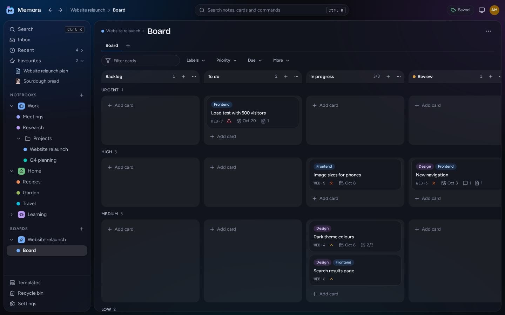
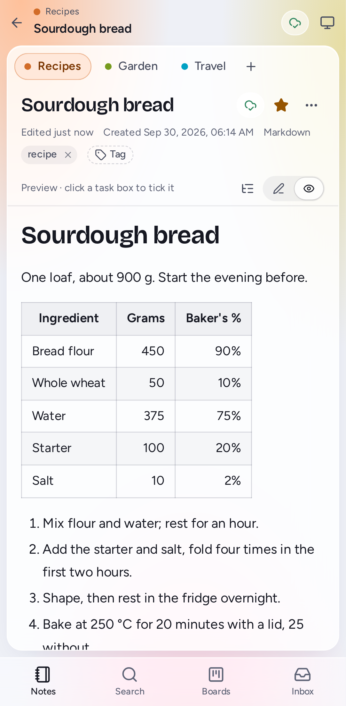

# Memora

A self-hosted notebook that runs in your browser. It combines OneNote-style organisation (notebooks, section tabs, page lists) with first-class Markdown, a Word-like rich editor and built-in Kanban boards. It is designed to look great on a phone, a laptop and an ultra-wide monitor.

> **Version 0.9: a public beta.** Everything planned for 1.0 is in and tested; 1.0 follows after time in real use. What's in it: [CHANGELOG.md](CHANGELOG.md).


## What it does

- **Organisation like OneNote, done better:** notebooks → section groups → coloured section tabs → pages and subpages, with drag and drop, an Inbox for quick notes, and a shortcut for everything.
- **Markdown notes:** a Notepad++-style source beside a live preview, tables that line up as you type, maths, diagrams and highlighted code.
- **Rich notes:** a Word-like editor with tables, callouts and images. Paste screenshots straight in, and clean pastes from Word, Google Docs and the web.
- **Never lose a keystroke:** autosave that works offline, an honest save indicator, merged edits from two devices, version history, a recycle bin, and scheduled backups (optionally encrypted).
- **Find it again:** full-text search, tags, links between pages with backlinks, favourites and templates.
- **Kanban:** projects with boards, swimlanes, WIP limits and cards that drag with a mouse, a finger or the keyboard. Any note links to any card.
- **Every screen:** panes with tabs on wide and ultra-wide monitors, a phone layout, and an installable app.
- **Open formats:** Markdown, Word, HTML, PDF, and a documented `.memora` archive, in and out.
- **Yours:** one small Docker container with one SQLite file, on a Synology NAS or any Docker host. No telemetry, nothing loaded from other sites, two-step verification, and a [security review](docs/SECURITY_REVIEW.md).

| Kanban boards                                                    | Dark theme                                                 | Phones                                             |
| ---------------------------------------------------------------- | ---------------------------------------------------------- | -------------------------------------------------- |
|  |  |  |

## Quick start

### Run with Docker

```bash
mkdir -p data && docker run -d --name memora --restart unless-stopped -p 3000:3000 -v ./data:/data ghcr.io/dreamtheater484/memora:latest
```

Then run `docker logs memora` for the setup code, and open `http://localhost:3000`. [docs/SETUP.md](docs/SETUP.md) is the full guide: Docker Compose, Synology, Linux, Windows, and HTTPS.

To try it with sample notes and a board, fill a new Memora with the demo dataset. With the setup code from its log, this creates the account `demo` and prints its password:

```bash
node scripts/demo/seed.mjs --url http://localhost:3000 --setup-code <setup-code>
```

To build the image yourself instead:

```bash
git clone https://github.com/dreamtheater484/memora.git && cd memora
```

```bash
docker build -f docker/Dockerfile -t memora:local .
```

Then run it as above, with `memora:local` as the image.

### Develop

Requires Node.js 22.13+ (24 recommended) and pnpm 10. In a clone of the repository:

```bash
pnpm install
```

```bash
pnpm dev
```

The web app runs at `http://localhost:5173` and the API at `http://localhost:3000`. Read [CONTRIBUTING.md](CONTRIBUTING.md) before your first commit: it explains the privacy guards.

## Documentation

- [Implementation plan](docs/IMPLEMENTATION_PLAN.md): scope, decisions, architecture, roadmap
- [User guide](docs/USER_GUIDE.md): using Memora
- [Setup guide](docs/SETUP.md): installing Memora with Docker
- [Updating](docs/UPGRADE.md) and [troubleshooting](docs/TROUBLESHOOTING.md)
- [Backups and restoring](docs/BACKUP_RESTORE.md): the schedule, encryption, Hyper Backup, restoring
- [Architecture](docs/ARCHITECTURE.md): how the code is organised
- [Contributing](CONTRIBUTING.md): development workflow and privacy rules
- [Security policy](docs/SECURITY.md) and [security review](docs/SECURITY_REVIEW.md): threat model, OWASP ASVS Level 1
- [Architecture decision records](docs/adr/)
- [Changelog](CHANGELOG.md) and [making a release](docs/RELEASING.md)

## License

[MIT](LICENSE). Memora is created and maintained by [dreamtheater484](https://github.com/dreamtheater484); the source is at [github.com/dreamtheater484/memora](https://github.com/dreamtheater484/memora).
