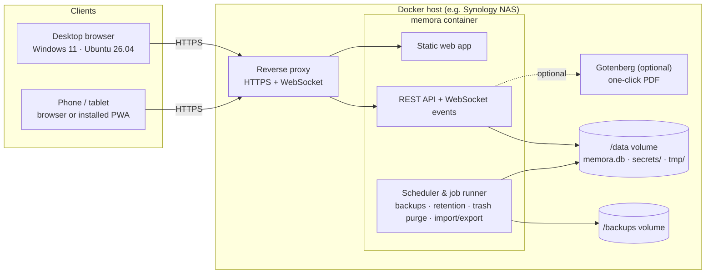

# Memora — Implementation Plan

> **Status:** v2 · 2026-09-29 · Phase 0 (foundation) complete
> **Nature:** Living document. Update it whenever a decision changes; every phase ends with a review of this plan.

---

## Table of contents

1. [Vision & guiding principles](#1-vision--guiding-principles)
2. [Scope](#2-scope)
3. [Decisions log](#3-decisions-log)
4. [Architecture](#4-architecture)
5. [Tech stack](#5-tech-stack)
6. [Repository layout & privacy rules (CRITICAL)](#6-repository-layout--privacy-rules-critical)
7. [Data model](#7-data-model)
8. [Storage & file formats](#8-storage--file-formats)
9. [Feature specifications](#9-feature-specifications)
10. [API overview](#10-api-overview)
11. [Security](#11-security)
12. [Deployment](#12-deployment)
13. [Quality: testing, CI & definition of done](#13-quality-testing-ci--definition-of-done)
14. [Performance budgets](#14-performance-budgets)
15. [Delivery plan (phases & milestones)](#15-delivery-plan-phases--milestones)
16. [Setup guide outline](#16-setup-guide-outline)
17. [Parked / future](#17-parked--future)
18. [Risks & mitigations](#18-risks--mitigations)
19. [Open questions](#19-open-questions)

---

## 1. Vision & guiding principles

**Memora** is a self-hosted notebook that runs in the browser. It takes OneNote's way of organising notes (notebooks, section tabs, page lists) and adds proper Markdown support, a Word-like rich-text editor and built-in Kanban boards. It should look great on a phone, on a laptop and on a 5120-pixel-wide monitor.

### Guiding principles

1. **Never lose a keystroke.** Every edit is saved on the device within about half a second and on the server shortly after. The save status is always visible and always accurate.
2. **Beautiful by default.** Visual design is a feature in its own right. It gets its own phase, design tokens, a sign-off step and regression tests, rather than being left for the end.
3. **Open formats, no lock-in.** Markdown stays plain Markdown. Export formats are documented, versioned and can be imported again.
4. **Private by design.** The repository and the Docker image contain nothing personal. At runtime Memora never contacts third parties: no CDNs, no telemetry, and all fonts are served by Memora itself.
5. **Runs anywhere Docker runs.** Synology is the main target, but nothing in the image is specific to Synology.
6. **Simple outside, rigorous inside.** The interface is easy for non-technical users. Tests, migrations and backups keep things reliable underneath.

---

## 2. Scope

### 2.1 In scope for v1.0

| Area                 | Summary                                                                                                                                                                         |
| -------------------- | ------------------------------------------------------------------------------------------------------------------------------------------------------------------------------- |
| Platforms            | Browser app for phone, tablet, desktop and ultra-wide screens (DQHD 5120×1440). It can be installed as a PWA (a web app that installs like a native app).                       |
| Client OS / browsers | Any modern browser on Windows 11, Ubuntu 26.04, Android and iOS/iPadOS: Chromium-based (Chrome/Edge), Firefox and Safari.                                                       |
| Server               | One Docker container. Synology Container Manager is the main target, but any Docker host works (Docker Engine on Ubuntu 26.04, Docker Desktop on Windows 11, other NAS brands). |
| Users                | Accounts with username and password, starting with a single admin. Each user's data is private. Two-factor authentication (2FA) is optional.                                    |
| Organisation         | OneNote-style hierarchy: notebooks → section groups → sections (tabs along the top) → pages and subpages (page list, on the right by default).                                  |
| Markdown notes       | Notepad++-style source view, rendered preview and split view. Tables realign automatically. Toolbar, shortcuts and slash commands make writing easy.                            |
| Rich notes           | Word-like editor. Images can be pasted, whether screenshots or images copied from a browser. Supports tables. Exports to Word and PDF.                                          |
| Autosave             | Unsynced changes are kept on the device, the save indicator is always accurate, and conflicting edits are detected and resolved.                                                |
| Safety               | Version history per page, recycle bin, and automatic backups that can be encrypted.                                                                                             |
| Findability          | Full-text search, a command palette (Ctrl/Cmd+K), tags, favourites, recent pages, templates, and links between pages with backlinks.                                            |
| Import/export        | Single notes, sections, notebooks or everything, as `.memora`, `.md`/`.zip`, `.docx`, `.pdf` and `.html`.                                                                       |
| Kanban               | Projects, each with several boards, and the full standard Kanban feature set. Notes can be linked to cards.                                                                     |
| Workspace            | Multiple panes side by side for wide screens. Responsive layouts for every screen size.                                                                                         |
| Documentation        | Setup guide (generic Docker plus step-by-step Synology), upgrade guide, backup and restore guide, user guide.                                                                   |

### 2.2 Out of scope for v1.0

These are parked and listed in §17. The data model is designed so they can be added later without a rewrite.

- Sharing notebooks or boards between users, card assignees, real-time co-editing.
- End-to-end encryption.
- Importers for OneNote, Joplin or Evernote.
- Native desktop or mobile apps.

---

## 3. Decisions log

| #   | Topic                            | Decision                                                                                                                                                                                                                                                                                                                                                                                                                 | Rationale                                                                                                                                                                                                                                        |
| --- | -------------------------------- | ------------------------------------------------------------------------------------------------------------------------------------------------------------------------------------------------------------------------------------------------------------------------------------------------------------------------------------------------------------------------------------------------------------------------ | ------------------------------------------------------------------------------------------------------------------------------------------------------------------------------------------------------------------------------------------------ |
| D1  | Hosting                          | A self-hosted server in Docker (option C). Main target: Synology Container Manager. Any Docker host is supported.                                                                                                                                                                                                                                                                                                        | Every device sees the same notes, and there is one authoritative store.                                                                                                                                                                          |
| D2  | Users                            | Username/password accounts, starting with one admin. Data is private per user. Sharing is parked.                                                                                                                                                                                                                                                                                                                        | Requested. The data model keeps an `owner_id` everywhere so sharing can be added later.                                                                                                                                                          |
| D3  | Server storage                   | One SQLite database file in WAL mode, with images stored inside it.                                                                                                                                                                                                                                                                                                                                                      | Meets the "one file" requirement. Saves are transactional, and backups and moves are simple.                                                                                                                                                     |
| D4  | Portable format                  | A `.memora` archive: a zip of JSON, Markdown and asset files. It is versioned, documented and can optionally be encrypted.                                                                                                                                                                                                                                                                                               | It is an open format you can inspect, and it survives app upgrades.                                                                                                                                                                              |
| D5  | Note types                       | Each page is either **Markdown** or **Rich**. You can convert between them. The app warns you about anything that would be lost and takes a snapshot before converting.                                                                                                                                                                                                                                                  | Keeps each format faithful instead of degrading both.                                                                                                                                                                                            |
| D6  | Markdown editing (answer to Q4)  | Default on desktop is **Split** view: Notepad++-style highlighted source on the left, live preview on the right. **Source** and **Preview** modes are also available, and phones switch between them. An inline "Live" mode (Typora/Obsidian style) is a v1.x candidate.                                                                                                                                                 | Split view gives exactly the Notepad++ view that was requested, makes good use of wide screens, is the most robust option, and shows auto-aligned tables best.                                                                                   |
| D7  | Rich editing                     | TipTap, which is built on ProseMirror.                                                                                                                                                                                                                                                                                                                                                                                   | Mature and extensible, with good support for tables, images and collaboration.                                                                                                                                                                   |
| D8  | Stack                            | TypeScript end to end: React and Vite for the frontend, Fastify for the backend, Drizzle with better-sqlite3 for the database.                                                                                                                                                                                                                                                                                           | One language, with types and validation shared between client and server. Light enough for a NAS.                                                                                                                                                |
| D9  | Conflicts                        | Revision-based optimistic concurrency: each save names the revision it was based on. Markdown edits that don't overlap merge automatically (3-way merge). Otherwise a conflict screen asks you to choose. Nothing is ever discarded.                                                                                                                                                                                     | Much simpler than CRDTs and enough for one user on several devices. CRDTs stay an option for later co-editing.                                                                                                                                   |
| D10 | Offline                          | PWA with a service worker. Unsynced changes wait in an IndexedDB outbox, and cached notes can be edited offline.                                                                                                                                                                                                                                                                                                         | A keystroke is never lost to a flaky connection.                                                                                                                                                                                                 |
| D11 | PDF                              | By default, a print-optimised view followed by the browser's "Save as PDF". If the optional Gotenberg container is configured, PDF export is one click.                                                                                                                                                                                                                                                                  | Keeps the main image small, which matters on low-power NAS devices.                                                                                                                                                                              |
| D12 | Encryption (answer to Q6)        | **Easy, so in scope now:** encrypted backups and exports. **Moderate, so Phase 12 and optional:** encrypting the database file at rest. **Hard, so parked:** end-to-end encryption.                                                                                                                                                                                                                                      | Protects copies that leave the NAS first, since those are the likeliest to leak.                                                                                                                                                                 |
| D13 | Remote access                    | **WireGuard VPN into the home network; no public domain.** HTTPS is still **required** (service workers, secure cookies and the clipboard API only work in a secure context, even over a VPN), so Memora is served over HTTPS with a certificate from a small local certificate authority trusted on each device. Set up in Phase 2. The guide also documents Tailscale and domain/Let's Encrypt setups for other users. | Nothing exposed to the internet, and all browser features still work.                                                                                                                                                                            |
| D14 | IDs & ordering                   | IDs are UUIDv7, which the client can generate. Ordering uses fractional-index sort keys.                                                                                                                                                                                                                                                                                                                                 | Items can be created offline, and reordering by drag and drop is cheap.                                                                                                                                                                          |
| D15 | Distribution                     | An image published to GitHub Container Registry (GHCR) by GitHub Actions, or built locally. **amd64 is the primary, tested target** (the reference NAS is an x86-64 Synology). arm64 is built too, for other users.                                                                                                                                                                                                      | Matches the real hardware, while still usable on ARM NAS models.                                                                                                                                                                                 |
| D16 | Page list position               | On the right by default, like OneNote. Configurable to the left.                                                                                                                                                                                                                                                                                                                                                         | Your preference, with flexibility.                                                                                                                                                                                                               |
| D17 | UI language                      | English only (confirmed). The code is ready for translations (i18n).                                                                                                                                                                                                                                                                                                                                                     | Other languages can be added later without refactoring.                                                                                                                                                                                          |
| D18 | Repository & licence             | **Public** GitHub repository under the **MIT** licence. The copyright holder is "Memora contributors", so no personal name is needed.                                                                                                                                                                                                                                                                                    | Public was requested; MIT is the simplest permissive licence. It can still be changed to AGPL-3.0 before the first push, if you want forks that host Memora to publish their changes.                                                            |
| D19 | RAM budget                       | Conservative by default: V8 heap capped at 256 MB (`MEMORA_MAX_HEAP_MB`), SQLite page cache left at its small default, no Chromium in the main image, streaming for large imports and exports. Measured in Phase 0: about 40 MB for the container at idle.                                                                                                                                                               | The NAS is shared with other services. Every extra RAM use must be justified.                                                                                                                                                                    |
| D20 | Tooling adjustments (Phase 0)    | pnpm 10 (the corepack in some Linux distributions cannot run pnpm 11+); TypeScript 6 (typescript-eslint doesn't support TypeScript 7 yet); **secretlint** in the local pre-commit hook (pure Node.js, identical on Windows and Linux) and **gitleaks** in CI over the full history; **Dependabot** instead of Renovate (no app to install).                                                                              | Works the same on every developer machine and needs no extra installs.                                                                                                                                                                           |
| D21 | Visual direction (Phase 1)       | **Aurora** (direction B of the Phase 1 mockups): frosted, translucent panels float over a soft ambient glow in the colour of the current section, and the accent colour follows the section. Type: Figtree for the interface, Bricolage Grotesque for titles, JetBrains Mono for code. Reference mockup: `design/mockups/directions.html`.                                                                               | Chosen by the owner from three directions (Ink, Aurora, Spectrum). Needs a solid, non-blurred fallback for reduced transparency and low-power devices, and text contrast checked against the glass surfaces.                                     |
| D22 | Component gallery & visual tests | A **built-in, development-only gallery page** in the web app (`/gallery.html`) instead of Ladle. Playwright takes the visual snapshots and runs axe, inside the official Playwright Docker image, locally and in CI.                                                                                                                                                                                                     | Ladle 5 pins Vite 6 and pulls in about 40 packages, including its own React plugin; the built-in page uses the app's own Vite 8 and Tailwind pipeline. Running Playwright in one fixed image keeps screenshots pixel-identical on every machine. |

---

## 4. Architecture



### 4.1 Server (`apps/server`)

- **Fastify** app that provides:
  - the REST API under `/api/v1`;
  - a WebSocket event channel at `/api/v1/events`;
  - the built web app as static files;
  - `/api/health` for Docker health checks.
- A **scheduler** for backups, version-history thinning, trash purges and cleanup of unused assets.
- A **job runner** for long imports and exports. Jobs report progress over the WebSocket.
- A **data access layer**: every query goes through repositories that always filter by the signed-in user, so one user can never reach another's data.
- All state lives in `/data` (plus `/backups`), so moving or restoring Memora means copying one folder.

### 4.2 Client (`apps/web`)

| Layer          | Responsibility                                                                                                                                                                                                                       |
| -------------- | ------------------------------------------------------------------------------------------------------------------------------------------------------------------------------------------------------------------------------------ |
| UI             | React components built on Memora's own design system (§9.13).                                                                                                                                                                        |
| State          | TanStack Query caches server data. Zustand holds UI and workspace state (open panes, layout, selection).                                                                                                                             |
| Sync engine    | IndexedDB outbox, save scheduler, conflict handling, WebSocket subscriber. Tabs in the same browser coordinate over a `BroadcastChannel` so only one of them syncs.                                                                  |
| Service worker | Caches the app shell and assets and handles the offline fallback. Shows an "update available" prompt.                                                                                                                                |
| Editors        | CodeMirror 6 for Markdown and TipTap for rich notes. Both sit behind one `NoteEditor` interface (`getContent`, `setContent`, `onChange`, `focus`, `exec(command)`), so autosave, history, links and search behave the same for both. |

### 4.3 Shared package (`packages/shared`)

- Zod schemas and TypeScript types for every API payload and archive file.
- The Markdown pipeline: parse, render and plain-text extraction, used by both client and server.
- The table formatter (a pure function with its own tests).
- Converters between Markdown and the rich-note format.
- Fractional-index helpers, the ID generator and the archive format definitions.

---

## 5. Tech stack

Versions are pinned in Phase 0. Every dependency is bundled, so nothing loads from a CDN at runtime.

| Area                 | Choice                                                                                                                                          | Why                                                                         |
| -------------------- | ----------------------------------------------------------------------------------------------------------------------------------------------- | --------------------------------------------------------------------------- |
| Language             | TypeScript 6 (strict)                                                                                                                           | One language across the stack, with types shared between client and server. |
| Runtime              | Node.js 24 LTS in the image; 22.13+ supported for development                                                                                   | Stable, long support window.                                                |
| Monorepo             | pnpm 10 workspaces                                                                                                                              | Fast installs, strict dependency handling.                                  |
| HTTP server          | Fastify 5 plus `@fastify/websocket`, `rate-limit`, `helmet`, `cookie`, `multipart`                                                              | Fast, mature, schema-driven.                                                |
| Validation           | zod                                                                                                                                             | Shared between client and server.                                           |
| Database             | SQLite through `better-sqlite3`; Drizzle ORM and `drizzle-kit` migrations; FTS5 for search                                                      | Single file, very fast, typed schema.                                       |
| Password hashing     | Argon2id via `@node-rs/argon2`                                                                                                                  | Prebuilt for amd64 and arm64, so no compiler is needed in the image.        |
| Logging              | pino, JSON to stdout                                                                                                                            | Readable with `docker logs`.                                                |
| Frontend             | React 19, Vite, TanStack Router, TanStack Query, Zustand                                                                                        | Modern, fast to build with, very large ecosystem.                           |
| Styling & UI         | Tailwind CSS v4 with CSS-variable design tokens; Radix UI primitives; CSS transitions (Motion only where they are not enough); Lucide icons     | A polished look with full design control, plus accessible primitives.       |
| Fonts (self-hosted)  | Figtree (interface), Bricolage Grotesque (titles), JetBrains Mono (source and code), optional reading fonts (Source Serif 4, Literata); see D21 | All under the SIL Open Font License, so no Google Fonts calls.              |
| Markdown editor      | CodeMirror 6 with `@lezer/markdown`                                                                                                             | Best-in-class code editor that handles very large documents.                |
| Rich editor          | TipTap 3 (ProseMirror)                                                                                                                          | Tables, images and a rich extension ecosystem.                              |
| Markdown rendering   | unified / remark / rehype: `remark-gfm`, `remark-math` with KaTeX, Mermaid (lazy-loaded), Shiki (lazy-loaded), `rehype-sanitize`                | Works on a syntax tree, which the converters and search indexing also use.  |
| Clipboard conversion | turndown with the GFM plugin (HTML → Markdown)                                                                                                  | Pasting web content produces clean Markdown.                                |
| Drag & drop          | dnd-kit                                                                                                                                         | Works with mouse, touch and keyboard, and is accessible.                    |
| Offline              | `vite-plugin-pwa` (Workbox) and Dexie (IndexedDB)                                                                                               | Proven tools for PWAs and offline storage.                                  |
| Word                 | `docx` for export, `mammoth` for import                                                                                                         | Both run in pure JavaScript.                                                |
| PDF                  | Print CSS with Paged.js for pagination; optional Gotenberg sidecar                                                                              | High quality without shipping Chromium in the main image.                   |
| Archives & crypto    | `fflate` (zip); Node `crypto` (AES-256-GCM, scrypt)                                                                                             | Fast, and nothing extra is needed for encryption.                           |
| Diff / merge         | `node-diff3` for 3-way merge, `diff` (jsdiff) for displaying changes                                                                            | Powers Markdown auto-merge and the history diff view.                       |
| Tests                | Vitest with Testing Library, Playwright, axe-core, a built-in component gallery with visual snapshots (D22)                                     | Covers units, API, browsers, accessibility and visual regressions.          |
| Tooling              | ESLint, Prettier, lefthook (git hooks), secretlint (local), gitleaks (CI), Dependabot                                                           | Code quality plus the privacy and secret guards.                            |
| CI/CD                | GitHub Actions, docker buildx (multi-arch), GHCR, Trivy                                                                                         | Automated builds and security scans.                                        |

---

## 6. Repository layout & privacy rules (CRITICAL)

### 6.1 Layout

```
memora/
├─ apps/
│  ├─ server/                 # Fastify API, scheduler, jobs, migrations
│  └─ web/                    # React app, editors, service worker
├─ packages/
│  └─ shared/                 # schemas, types, markdown pipeline, table formatter, archive format
├─ design/
│  └─ mockups/                # Phase 1 clickable mockups (reference for the design system)
├─ docker/
│  ├─ Dockerfile              # multi-stage, multi-arch
│  ├─ entrypoint.sh           # PUID/PGID handling, then drops root
│  └─ docker-compose.example.yml
├─ docs/
│  ├─ IMPLEMENTATION_PLAN.md  # this file
│  ├─ SETUP.md                # installation guide (generic Docker + Synology)
│  ├─ UPGRADE.md
│  ├─ BACKUP_RESTORE.md
│  ├─ USER_GUIDE.md
│  ├─ ARCHITECTURE.md
│  ├─ FILE_FORMAT.md          # .memora archive specification
│  ├─ SECURITY.md
│  └─ adr/                    # architecture decision records (one per major decision)
├─ scripts/
│  └─ check-forbidden.mjs     # privacy guard (see §6.3)
├─ .github/workflows/         # ci.yml, release.yml
├─ .gitignore  .gitattributes  .editorconfig  .gitleaks.toml  lefthook.yml
├─ package.json  pnpm-workspace.yaml  tsconfig.base.json
└─ README.md
```

### 6.2 What the repository must never contain

| Category                 | Examples                                                                                                               |
| ------------------------ | ---------------------------------------------------------------------------------------------------------------------- |
| **Secrets (critical)**   | Passwords, tokens, API keys, session secrets, private keys, database encryption keys, registry tokens, `.env` files    |
| **Local paths**          | Any absolute path on a personal machine: home directories, mounted drives, Windows user profile folders, machine names |
| **Personal identifiers** | Usernames, real names, personal email addresses, NAS hostnames and IP addresses, domain names in real use              |
| **User data**            | Databases, backups, exports, screenshots showing real notes                                                            |

### 6.3 How the rules are enforced (several layers)

1. **By design**
   - Code only uses relative paths or fixed container paths such as `/data`.
   - The session secret is generated on first start and stored in `/data/secrets/`. It never appears in environment files or compose files.
   - Examples use placeholders only: `<nas-ip>`, `notes.example.com`, `<your-github-user>`.
2. **`.gitignore`** (§6.4) excludes data, builds, environment files and local tool configuration.
3. **Git identity.** A repo-local `user.email` set to your GitHub **noreply** address, checked automatically by the pre-commit hook (`scripts/check-git-identity.mjs`). CI checks the author and committer of every commit. Also turn on GitHub's _"Block command line pushes that expose my email"_.
4. **Pre-commit hook** (lefthook):
   - `secretlint` catches secrets in staged files.
   - `scripts/check-forbidden.mjs` blocks generic personal patterns: Linux/macOS home directories, Linux removable-media mount points, Windows user profile folders, private (RFC 1918) IP addresses outside the documented placeholders, and email addresses other than `noreply` or `example.*`.
   - The same script also reads personal strings (such as your username) from **`.forbidden-strings.local`**. That file is **gitignored**, so the list of personal strings is never committed either.
5. **CI** runs gitleaks over the **whole history**, the same forbidden-pattern check and the commit-identity check. A failure blocks merging. A `commit-msg` hook also scans commit messages, and a `pre-push` hook scans every file.
6. **Build hygiene.**
   - Builds run in CI or containers under neutral paths (`/app`).
   - Production source maps are off, or use relative paths only.
   - Before each release the image is inspected: `docker history`, plus `check-forbidden.mjs --personal-only` over the image's files. Only personal strings are checked there, because third-party code legitimately contains example IP addresses and author emails.
7. **Test data** is synthetic only. Documentation screenshots come from a generated demo notebook.
8. **Tooling files.** `.claude/settings.local.json`, editor user settings and similar files are ignored. `CLAUDE.md` may be committed only if it contains no paths or personal details.

### 6.4 `.gitignore` baseline

```gitignore
# dependencies & builds
node_modules/
dist/
build/
coverage/
*.tsbuildinfo
.vite/
playwright-report/
test-results/

# environment & secrets
.env
.env.*
!.env.example
*.pem
*.key
secrets/
.forbidden-strings.local

# user data — never commit
data/
backups/
*.db
*.db-wal
*.db-shm
*.sqlite
*.memora

# local tooling
.claude/settings.local.json
.vscode/*
!.vscode/extensions.json
.idea/
*.log

# OS files
.DS_Store
Thumbs.db
desktop.ini
```

`.gitattributes` sets `* text=auto eol=lf`, so line endings stay consistent between Windows 11 and Ubuntu.

---

## 7. Data model

**Conventions**

- Primary keys are UUIDv7.
- `created_at` and `updated_at` are UTC epoch milliseconds.
- `deleted_at` marks a soft delete.
- `sort_key` holds a fractional-index string used for ordering.
- Every top-level user entity has an `owner_id`.
- Foreign keys are enforced.

### 7.1 Identity & system

| Table            | Key fields                                                                                                                                                                                    |
| ---------------- | --------------------------------------------------------------------------------------------------------------------------------------------------------------------------------------------- |
| `users`          | `id`, `username` (unique, case-insensitive), `display_name`, `password_hash`, `role` (`admin`/`user`), `must_change_password`, `totp_secret_enc`, `totp_enabled`, `disabled_at`, `created_at` |
| `sessions`       | `id`, `user_id`, `token_hash`, `created_at`, `last_seen_at`, `expires_at`, `user_agent`, `ip`, `device_label`                                                                                 |
| `recovery_codes` | `user_id`, `code_hash`, `used_at`                                                                                                                                                             |
| `user_settings`  | `user_id`, `key`, `value_json`                                                                                                                                                                |
| `audit_log`      | `id`, `user_id`, `event` (login, login_failed, password_changed, user_created, backup_restored, …), `meta_json`, `ip`, `created_at`                                                           |
| `app_meta`       | `schema_version`, `instance_id`, `created_with_version`                                                                                                                                       |
| `jobs`           | `id`, `owner_id`, `type` (import/export/backup/restore), `status`, `progress`, `result_json`, `error`, timestamps                                                                             |

### 7.2 Notes

| Table                | Key fields                                                                                                                                                                                                                                                                       |
| -------------------- | -------------------------------------------------------------------------------------------------------------------------------------------------------------------------------------------------------------------------------------------------------------------------------- |
| `notebooks`          | `id`, `owner_id`, `name`, `color`, `icon`, `sort_key`, `deleted_at`                                                                                                                                                                                                              |
| `section_groups`     | `id`, `notebook_id`, `parent_group_id` (nullable, nestable), `name`, `sort_key`, `deleted_at`                                                                                                                                                                                    |
| `sections`           | `id`, `notebook_id`, `group_id` (nullable), `name`, `color`, `sort_key`, `is_inbox`, `deleted_at`                                                                                                                                                                                |
| `pages`              | `id`, `section_id`, `parent_page_id` (subpages, maximum depth 3), `title`, `type` (`markdown`/`rich`), `content` (Markdown text or TipTap JSON), `content_text` (plain text for search), `revision` (integer), `sort_key`, `view_mode`, `created_at`, `updated_at`, `deleted_at` |
| `page_versions`      | `id`, `page_id`, `revision`, `type`, `content`, `title`, `reason` (`auto`/`conversion`/`import`/`restore`/`conflict`/`manual`), `device_label`, `created_at`                                                                                                                     |
| `tags` / `page_tags` | `id`, `owner_id`, `name`, `color` / `page_id`, `tag_id`                                                                                                                                                                                                                          |
| `page_links`         | `source_page_id`, `target_page_id`, `target_title_snapshot`. Rebuilt on every save and used for backlinks and rename-safe links.                                                                                                                                                 |
| `favorites`          | `user_id`, `entity_type`, `entity_id`, `sort_key`                                                                                                                                                                                                                                |
| `recent_items`       | `user_id`, `entity_type`, `entity_id`, `last_opened_at`                                                                                                                                                                                                                          |
| `templates`          | `id`, `owner_id` (null means built-in), `name`, `type`, `content`, `sort_key`                                                                                                                                                                                                    |

### 7.3 Assets

| Table        | Key fields                                                                                                                                               |
| ------------ | -------------------------------------------------------------------------------------------------------------------------------------------------------- |
| `assets`     | `id`, `owner_id`, `sha256` (unique per owner, used to de-duplicate), `mime`, `size`, `width`, `height`, `original_name`, `data` (BLOB), `created_at`     |
| `asset_refs` | `asset_id`, `entity_type` (page/card/comment), `entity_id`. Unreferenced assets are cleaned up once they are also absent from version history and trash. |

### 7.4 Kanban

| Table                            | Key fields                                                                                                                                                                                                                                                                                                                           |
| -------------------------------- | ------------------------------------------------------------------------------------------------------------------------------------------------------------------------------------------------------------------------------------------------------------------------------------------------------------------------------------ |
| `projects`                       | `id`, `owner_id`, `name`, `key` (for example `WEB`, used in card keys), `color`, `icon`, `sort_key`, `archived_at`, `next_card_number`                                                                                                                                                                                               |
| `boards`                         | `id`, `project_id`, `name`, `description`, `sort_key`, `settings_json` (swimlanes on/off, card fields shown, default sort), `archived_at`                                                                                                                                                                                            |
| `columns`                        | `id`, `board_id`, `name`, `color`, `wip_limit`, `wip_strict`, `is_done`, `collapsed`, `sort_key`, `archived_at`                                                                                                                                                                                                                      |
| `swimlanes`                      | `id`, `board_id`, `name`, `color`, `collapsed`, `sort_key`                                                                                                                                                                                                                                                                           |
| `cards`                          | `id`, `board_id`, `column_id`, `swimlane_id`, `number` (card key = project key + number, e.g. `WEB-42`), `title`, `description` (Markdown), `priority` (`none`/`low`/`medium`/`high`/`urgent`), `start_date`, `due_date`, `cover_color`, `assignee_id` (reserved for sharing), `sort_key`, `completed_at`, `archived_at`, timestamps |
| `labels` / `card_labels`         | `id`, `project_id`, `name`, `color`. Labels belong to the project, so every board in the project shares them.                                                                                                                                                                                                                        |
| `checklists` / `checklist_items` | `id`, `card_id`, `title`, `sort_key` / `id`, `checklist_id`, `text`, `done`, `sort_key`                                                                                                                                                                                                                                              |
| `card_comments`                  | `id`, `card_id`, `user_id`, `body` (Markdown), `created_at`, `edited_at`                                                                                                                                                                                                                                                             |
| `card_pages`                     | `card_id`, `page_id`, `created_at`. The many-to-many link between notes and cards.                                                                                                                                                                                                                                                   |
| `card_attachments`               | `card_id`, `asset_id`, `sort_key`                                                                                                                                                                                                                                                                                                    |
| `card_activity`                  | `id`, `card_id`, `user_id`, `type` (created, moved, renamed, due_changed, note_linked, …), `payload_json`, `created_at`                                                                                                                                                                                                              |

### 7.5 Search

- `fts_pages`: an FTS5 table over `title`, `content_text` and tag names, using the `unicode61 remove_diacritics 2` tokenizer with prefix indexes.
- `fts_cards`: title, description, comments, checklist text and the card key.
- Both are kept in sync inside the same transaction as each save.

---

## 8. Storage & file formats

### 8.1 Server storage (`/data`)

```
/data
├─ memora.db            # everything: users, notes, images, boards, history
├─ memora.db-wal        # SQLite working files while running (normal, part of the database)
├─ memora.db-shm
├─ secrets/             # generated on first start (session key); never leaves the host
└─ tmp/                 # import/export scratch space, cleaned automatically
/backups                # separate mount recommended (defaults to /data/backups if not mounted)
```

- SQLite pragmas:
  - `journal_mode=WAL`, so reading never blocks writing.
  - `synchronous=FULL`. A save the server has confirmed survives even a power cut. The client deletes its local copy only after that confirmation.
  - `foreign_keys=ON`, `busy_timeout=5000`.
- **Never copy a running `memora.db` file as a backup.** Use Memora's own backups (§9.14). They are consistent single-file snapshots.

### 8.2 Markdown dialect

- CommonMark plus GFM: tables, task lists, strikethrough, autolinks.
- Also supported: footnotes, GitHub-style alerts (`> [!NOTE]`, `[!TIP]`, `[!WARNING]`, …), maths (`$…$`, `$$…$$`), Mermaid code blocks, and wiki links (`[[Page title]]`, `[[Page title|shown text]]`, `[[Page title#Heading]]`).
- Images are stored internally as ``. On export they become relative file paths (`assets/<name>.png`).
- Wiki links stay readable titles in the text. `page_links` stores the target IDs, so renaming a page updates every page that links to it.

### 8.3 Rich note storage

- Stored as TipTap/ProseMirror JSON. Images and attachments are referenced by asset ID, never embedded as base64.
- `content_text` holds a plain-text extraction, updated on each save for search and previews.

### 8.4 `.memora` archive (format v1)

A zip file. When encrypted, the zip is wrapped in an encryption envelope.

```
manifest.json                          # format, version, app version, exported_at, scope, counts, checksums
notebooks/<notebook-id>/notebook.json
notebooks/<notebook-id>/groups/<group-id>.json
notebooks/<notebook-id>/sections/<section-id>/section.json
notebooks/<notebook-id>/sections/<section-id>/pages/<page-id>.json    # metadata, tags, links
notebooks/<notebook-id>/sections/<section-id>/pages/<page-id>.md      # markdown pages
notebooks/<notebook-id>/sections/<section-id>/pages/<page-id>.rich.json  # rich pages
notebooks/<notebook-id>/sections/<section-id>/pages/<page-id>.html   # rich pages, rendered (readable without Memora)
history/<page-id>.jsonl                # optional: version history
kanban/projects/<project-id>.json      # project, labels
kanban/boards/<board-id>.json          # columns, swimlanes, cards, checklists, comments, links
assets/<sha256>.<ext>
templates/<template-id>.json
```

- **`manifest.json`** looks like this: `{ "format": "memora-archive", "formatVersion": 1, "appVersion": "1.0.0", "exportedAt": "…", "scope": { "type": "notebook", "ids": [...] }, "counts": {...}, "sha256": {...} }`.
- **Encryption envelope.** The file starts with the magic bytes `MEMORAENC1`, followed by KDF parameters (scrypt), a salt, a nonce, and the zip encrypted with AES-256-GCM. It keeps the `.memora` extension, and Memora recognises encrypted files automatically.
- **Compatibility.** Memora imports every older `formatVersion`. A file newer than the running app is refused with a clear message.
- The full specification goes in `docs/FILE_FORMAT.md` in Phase 9.

### 8.5 Markdown folder export

A portable export meant for other tools, using readable names:

```
My Notebook/
├─ Work/                      # section
│  ├─ Meeting notes.md
│  ├─ Project plan.md
│  └─ Project plan/           # subpages
│     └─ Risks.md
└─ assets/
   └─ screenshot-2026-09-29-1432.png
```

- An optional front-matter block at the top of each file records tags, created/updated dates and the Memora ID, so a later import can restore them.
- Rich pages are converted to Markdown, and a report lists anything that couldn't be converted.

---

## 9. Feature specifications

### 9.1 Accounts & authentication

- **First-run setup.** On first start with no users, the server prints a **one-time setup code** to the container log. The setup wizard asks for that code before it creates the admin account, so nobody else who reaches the page first can take over the instance.
- **Login.**
  - Username and password, with an optional "remember this device" (default session length 30 days, 12 hours without it; both configurable).
  - Sessions use a secure cookie and are stored on the server, where they can be revoked.
- **Password policy.** At least 12 characters, checked against a bundled list of common passwords. No arbitrary complexity rules.
- **Account page.**
  - Change password and display name.
  - List active sessions and devices and revoke any of them.
  - Set up 2FA with an authenticator app (TOTP) plus recovery codes. Arrives in Phase 12.
- **Admin.**
  - Create, disable and delete users, and reset passwords (sets a temporary password that must be changed at next login).
  - Assign roles.
  - Enforce 2FA.
  - View the audit log.
- **Command-line fallback** inside the container:
  - `memora-admin reset-password <user>`
  - `memora-admin list-users`
  - `memora-admin backup`
  - `memora-admin restore <file>`
- **Isolation.** Users see only their own data. Tests try cross-user access (one user using another user's IDs) on every endpoint.

### 9.2 Organisation (OneNote model, improved)

- **Notebooks.**
  - Listed in a collapsible left rail, each with a colour and icon.
  - Reorder by dragging; rename and delete from the context menu.
- **Section groups.**
  - Nestable. Shown as a special tab that opens a dropdown.
  - Breadcrumbs make it clear where you are.
- **Sections: coloured tabs along the top.**
  - A curated palette of 12 section colours, tuned for both light and dark themes.
  - Drag to reorder, or drag onto another notebook or group to move.
  - Double-click to rename.
  - When there are too many tabs, they scroll and an overflow menu appears.
  - Each section's colour continues subtly into its page list and editor header, like OneNote but calmer.
- **Page list: on the right by default, configurable.**
  - Subpages up to 3 levels deep. Drag to reorder and to indent/outdent; keyboard shortcuts `Tab`/`Shift+Tab` do the same.
  - Select several pages at once to move or delete them together.
  - Each entry shows a snippet of the content and the modified date.
- **Page header.** Large title, created and modified dates, tags, the save indicator, and a menu with export, history, convert, move/copy, duplicate and delete.
- **Move / copy dialog.** A searchable notebook → section picker. Also available by dragging pages onto a section tab.
- **Inbox (like OneNote's Quick Notes).**
  - Every user has one.
  - "Quick note" (`Ctrl/Cmd+Alt+N`, or a floating button on phones) captures straight into the Inbox.
- **Context menus** everywhere, plus keyboard shortcuts for every action and a shortcut reference sheet (`?`).
- **UI state per user.** Memora remembers the last open page, expanded groups, pane layout and view modes on the server, so another device picks up where you left off.

### 9.3 Markdown notes

**View modes (D6)**

- **Split** is the default on desktop and tablet in landscape. Source on the left, rendered preview on the right, with synced scrolling (source line ↔ preview block).
- **Source**: the Notepad++-style view only.
- **Preview**: read-only rendering. Clicking a task box still toggles it.
- Phones switch between Source and Preview with one tap. The chosen mode is remembered per note.

**Notepad++-style source view**

- Colour highlighting for headings (sized by level), emphasis, links, inline code, code blocks (highlighted per language), lists, quotes, tables, HTML and front matter. Light and dark themes.
- Optional line numbers, current-line highlight, bracket matching, folding of headings and code blocks, optional visible whitespace, optional minimap.
- A monospace font (JetBrains Mono) for the source view, so table columns line up exactly.
- Optional inline image thumbnails under each `` line, so you can see the images while in source.
- Find and replace, with regular expressions.

**Table alignment (key requirement)**

- Tables are reformatted automatically when you:
  - press `Tab`/`Shift+Tab` (next/previous cell) or `Enter` (next row, or a new row at the end);
  - type `|`;
  - pause typing inside a table;
  - run the "Format table" command (`Ctrl/Cmd+Shift+F`).
- Cells are padded to the widest cell in each column. The alignment markers (`:--`, `:-:`, `--:`) are kept and applied in the padding.
- Widths are measured as displayed, not by character count (using `string-width`): emoji and Chinese/Japanese/Korean characters count as double width. Escaped pipes (`\|`) and pipes inside inline code are handled correctly.
- Commands: insert or delete a row or column, move a column left or right, set a column's alignment, sort by a column.
- The "Insert table" dialog uses a size-picking grid, like Word.
- Optional **grid editor**: edit a table as a spreadsheet-like grid, which is useful on phones. It writes back perfectly aligned Markdown.
- Optional "format all tables on save".
- Known limitation: exact alignment depends on the font giving wide characters exactly double width. The bundled font stack is chosen and tested for this.

**Easy-writing aids**

- A toolbar that collapses on narrow screens.
- Shortcuts:
  - `Ctrl/Cmd+B` / `I`: bold / italic;
  - `Ctrl/Cmd+K`: link (the command palette uses `Ctrl/Cmd+P` while a Markdown editor has focus; configurable);
  - `Ctrl/Cmd+1…6`: heading levels;
  - `Ctrl/Cmd+Shift+7` / `8` / `9`: numbered / bullet / task lists.
- Slash commands (`/table`, `/code`, `/mermaid`, `/callout`, `/image`, `/date`, `/template`).
- Lists continue when you press Enter and end when you press Enter on an empty item. Brackets and emphasis markers close automatically.
- Pasting a URL over selected text creates a link.
- `[[` suggests pages to link to as you type.
- **Paste:**
  - HTML becomes clean Markdown.
  - Images are stored as assets and inserted as ``.
  - Other files are stored as attachments and linked.
  - Spreadsheet cells become a Markdown table.
- Drag and drop works for images and files.

**Rendering**

- Everything in §8.2, with maths rendered by KaTeX and diagrams by Mermaid.
- Code blocks are highlighted by Shiki and have a copy button.
- Images can be clicked to open full size.
- The output is always sanitised.

**Extras**

- An outline panel (table of contents from the headings) that jumps to a heading when clicked.
- Word count and reading time.

### 9.4 Rich notes

- **Formatting.**
  - Headings, bold, italic, underline, strikethrough, superscript, subscript.
  - Text colour and highlight, font family and size (from a curated set), alignment, line spacing.
  - Bullet, numbered and task lists; quotes; callouts; horizontal rules; highlighted code blocks; maths.
- **Tables.** Header rows, merging and splitting cells, resizable columns, cell background colours, adding or removing rows and columns from a context menu.
- **Editing experience.**
  - A Word-like toolbar grouped Home / Insert / Table, which condenses to one row and then an overflow menu.
  - A floating menu on text selection, `/` slash commands, and drag handles for moving blocks.
  - Links to pages using `[[`.
- **Page view.** An optional A4/Letter width with page margins, which shows what a Word or PDF export will look like.
- **Pasting from Word, Google Docs and web pages.** Formatting is kept but cleaned: stray fonts and inline styles outside the supported set are removed.
- **Conversion to Markdown.**
  - Available from the page menu.
  - Before converting, a report lists what will be lost (colours, font sizes, merged cells, alignment…).
  - A snapshot is always taken before conversion.
  - Markdown → Rich conversion loses nothing.

### 9.5 Images & attachments

- **Paste screenshots.** Image data on the clipboard is uploaded as an asset and inserted where the cursor is.
- **Paste images from a browser.**
  - If the clipboard holds the image itself, it is uploaded directly.
  - If the clipboard holds only HTML with an ``, the server downloads the image (§11 SSRF protections apply), so the note never depends on an external link.
  - If that download fails, the user is told, and the link is kept.
- **Drag and drop and an upload button** work in both editors.
- **In rich notes:** resize handles, alignment (left/centre/right/inline), caption, alt text, and a full-size viewer.
- **Optional downscaling on paste.** Off by default. Can limit the longest edge (e.g. 2560 px) and re-encode photos to WebP. Screenshots stay lossless PNG.
- **Attachments.** Other files, such as PDFs, appear as file blocks and can be downloaded. The upload limit is configurable (default 25 MB).
- **De-duplication.** Identical files are stored once (by SHA-256 hash).

### 9.6 Autosave, offline & sync

**Save pipeline**

1. On every change, the editor content goes into the **IndexedDB outbox** within 300 ms. From that moment the change survives a crash, a closed tab or a lost connection.
2. The server save runs 1 s after the last keystroke, and at least every 5 s while you keep typing. Each save sends the full content plus the `baseRevision` it started from.
3. Saves are also sent immediately when you switch pages, when the tab is hidden or closed, when the editor loses focus, or when you press `Ctrl/Cmd+S` (optional; it just forces the save and confirms it).
4. The server writes the change in one transaction and replies with the new revision. Only then does the client remove the entry from its outbox.
5. Failed saves retry with increasing delays and jitter. They resume automatically when the connection returns.
6. Tabs in the same browser share one outbox, and a single "leader" tab does the syncing (`BroadcastChannel` plus Web Locks).

**Save indicator.** Shown in the page header, on each pane's tab, and as a global status in the app bar.

| State           | Shown as                                           | Meaning                                                                                                                                     |
| --------------- | -------------------------------------------------- | ------------------------------------------------------------------------------------------------------------------------------------------- |
| Saved           | ✓ "Saved" (tooltip: "Saved to server at 14:32:05") | The server has confirmed the latest content.                                                                                                |
| Saving          | Pulsing dot, "Saving…"                             | A save request is in progress.                                                                                                              |
| On this device  | Cloud-with-slash icon, "Saved on this device"      | Stored in the outbox; the server can't be reached yet (offline or server down).                                                             |
| Needs attention | Amber, "Changed elsewhere, review"                 | A conflict was detected. Both versions are kept.                                                                                            |
| Not saved       | Red, "Not saved, retrying", with details           | Even local storage failed (for example, the browser is out of space or is blocking storage). A clear warning appears and stays until fixed. |

- If closing the tab would lose unsynced changes that are **not** safely in the outbox, the browser asks you to confirm first.
- At startup, Memora checks that IndexedDB works (some private-browsing modes block it) and warns if it doesn't.

**Multiple devices**

- The WebSocket event channel tells other devices about changes. If the WebSocket is blocked (for example, by a misconfigured proxy), Memora falls back to polling every 30 s, and the admin System page shows the problem.
- A note open on another device, **with no local edits**, refreshes silently.
- A small **presence** hint, such as "Also open on: Phone", warns before edits collide.
- **Conflicts.** A conflict happens when the server's revision is newer than the client's `baseRevision`.
  - Markdown pages: Memora tries a 3-way merge, using the shared base version, the server version and the local version. If the edits don't overlap, the merged text is saved and shown without interrupting you.
  - Otherwise, and for rich pages: the local version is stored as a `conflict` version, and a banner offers **Keep mine**, **Keep theirs** or **Compare**. Compare is a side-by-side diff where you choose per block.
  - Nothing is ever silently discarded.

**Offline**

- The service worker caches the app itself, so it opens without a connection.
- Recently opened pages (and optionally all pages; a setting, off by default) are cached for offline reading and editing.
- Pages created offline get their IDs on the device and sync later.
- An offline banner shows how many changes are waiting.

### 9.7 Version history & recycle bin

**Snapshots.** Taken on the server:

- when content changed and the last snapshot is more than 10 minutes old;
- whenever a page is closed after being edited;
- always before a conversion, import, restore or conflict resolution;
- whenever you save one manually ("Save version…", with an optional name).

**Retention** (configurable):

- everything from the last 48 hours;
- then one per hour for 14 days;
- then one per day for 90 days;
- then one per week;
- named versions are always kept.

**History panel.**

- A timeline with device labels.
- A preview of any version.
- A **diff** against the current content or another version: line diff for Markdown, rendered side-by-side diff for rich pages.
- **Restore** makes the old version the current one as a new version, so restoring can itself be undone. **Restore as copy** creates a new page instead.

**Recycle bin.**

- Deleted notebooks, sections, pages, boards and cards end up here.
- Filter and search the bin.
- **Restore** puts an item back where it was. If that place is gone, you choose a new one.
- **Delete permanently** asks for confirmation. **Empty bin** is also available.
- Items are purged automatically after 30 days (configurable). Unused assets are cleaned up after the purge.

### 9.8 Search & navigation

- **Global search.**
  - Results appear as you type (150 ms debounce), with highlighted snippets.
  - Filters: notebook, section, tag, note type, modified date, and whether to include Kanban cards.
  - Ranking weights titles more than body text, with a small boost for recently opened items.
  - Search syntax: `"exact phrase"`, `-exclude`, `tag:work`, `in:"Section name"`.
- **Command palette (`Ctrl/Cmd+K`).** Jump to any notebook, section, page, project or board. Run commands ("New rich page", "Toggle dark mode", "Export notebook…"). Recent items are listed first.
- **Find in page (`Ctrl/Cmd+F`)** in both editors, with match highlighting. Replace is also available.
- **Breadcrumbs** and **back/forward** navigation (`Alt+←` / `Alt+→`) inside the app, and every page has a shareable link (`/p/<id>`) that works in bookmarks.

### 9.9 Tags, links, templates, favourites

- **Tags** appear as chips under the page title. Typing offers autocomplete. Each tag can have a colour. A tag browser lists pages by tag, and search can filter by tag.
- **Links between pages** (`[[…]]`) work in both editors, with autocomplete.
  - Renaming a page updates every link to it.
  - Links to deleted pages are marked as broken.
  - Hovering a link shows a preview of the target page.
- **Backlinks panel.** Lists "Linked from" (pages that link here) and "Linked cards" (Kanban cards linked to this page).
- **Favourites** are pinned at the top of the notebook rail. **Recent** keeps the last 50 opened items.
- **Templates.**
  - Built in: Meeting notes, To-do list, Project brief, Daily journal, Decision record.
  - Save any page as a template.
  - Offered in the "New page ▾" menu and through `/template`.
  - A default template can be set per section.

### 9.10 Import & export

| Format                                          | Single page          | Section / group                             | Notebook | Everything                             | Import                                                                    |
| ----------------------------------------------- | -------------------- | ------------------------------------------- | -------- | -------------------------------------- | ------------------------------------------------------------------------- |
| `.memora` (full fidelity, optionally encrypted) | ✓                    | ✓                                           | ✓        | ✓ (all notebooks + Kanban + templates) | ✓ as new, or merged into an existing notebook                             |
| `.md` (single file, or `.zip` if it has images) | ✓                    | —                                           | —        | —                                      | ✓                                                                         |
| Markdown folder `.zip` (§8.5)                   | —                    | ✓                                           | ✓        | ✓                                      | ✓ folders become sections, files become pages, subfolders become subpages |
| `.docx`                                         | ✓ (either note type) | ✓ (one document, page breaks between pages) | —        | —                                      | ✓ becomes a rich page                                                     |
| `.pdf`                                          | ✓                    | ✓                                           | —        | —                                      | —                                                                         |
| `.html` (single self-contained file)            | ✓                    | ✓                                           | —        | —                                      | ✓ becomes a rich page                                                     |
| `.txt`                                          | ✓                    | —                                           | —        | —                                      | ✓ becomes a Markdown page                                                 |

- Any page can be exported in any format (for example, a Markdown page to Word, or a rich page to Markdown with a loss report).
- **Starting an export:** from the page menu, a section tab's context menu, a notebook's context menu, or Settings → Data ("Export everything").
- **Starting an import:** Settings → Data, or drop files onto the page list or a section tab.
- Large imports and exports run as background jobs with a progress bar. Finished files stay available for 24 hours.
- **Imports are safe:**
  - Every file is validated and every HTML file sanitised.
  - When imported items are added as copies, they get new IDs so nothing clashes.
  - A summary report lists what was imported and what was skipped.
  - A snapshot is taken first when merging into an existing notebook.

**PDF**

- The print stylesheet provides headers and footers (title, page numbers), avoids breaking tables and images across pages, and paginates with Paged.js.
- The default flow is "Export PDF" → print preview → the browser's Save as PDF.
- When `MEMORA_GOTENBERG_URL` is set, "Export PDF" downloads the finished file directly.

**Word export** keeps headings (as real Word heading styles, so Word's table of contents works), lists, tables (including merged cells and column widths), images with captions, code blocks and links.

### 9.11 Kanban

**Structure.** Projects → multiple boards per project → columns (and optional swimlanes) → cards.

- **Projects.**
  - A name, a short key (used in card keys such as `WEB-42`), a colour and an icon.
  - Can be archived.
  - Switch between projects and boards from the rail, the command palette or a board switcher.
- **Board templates:** Basic (To do · Doing · Done), Extended (Backlog · To do · In progress · Review · Done), Empty.
- **Columns.**
  - Add, rename, reorder by dragging, colour, archive and delete.
  - **WIP limit**: a warning when exceeded, or strict mode that blocks adding more.
  - A **Done** flag: cards moved into a Done column are marked completed.
  - Can be collapsed.
  - Cards in a column can be sorted by hand, by due date, by priority or by created date.
- **Swimlanes.** Optional, per board. Either custom lanes, or automatic grouping by priority or label. Lanes can be collapsed and reordered by dragging.
- **Cards.**
  - **Quick add** at the top or bottom of any column: press `Enter` to add and keep typing the next one.
  - **Drag and drop** within and between columns and lanes, with mouse, touch (long-press) or keyboard. Animations are smooth and each move is saved optimistically, with undo (`Ctrl/Cmd+Z`).
  - **Forgiving drop targets (owner feedback on the Phase 1 mockup, where dropping was finicky):**
    - The **whole column is the drop target**, from its header down to the bottom of the board, including the empty space below the last card and an empty column.
    - The target column is chosen from the **pointer position**, not from how much the dragged card overlaps something. The gap between two columns goes to the nearer one.
    - A placeholder the size of the dragged card shows exactly where the card will land; the insertion point comes from the card midpoints. Dropping below the last card appends.
    - Whatever is highlighted is what you get: releasing always drops into the highlighted column. Only `Esc`, or releasing outside the board, cancels.
    - The board auto-scrolls near its left and right edges, and a column auto-scrolls near its top and bottom.
  - The card face shows: title, card key, labels, priority badge, due date (red when overdue, amber when due soon), checklist progress, comment and attachment counts, number of linked notes, and cover colour.
  - **Details panel.** A side panel on desktop, a full-screen sheet on phones. It holds:
    - title and a Markdown description (same renderer as notes);
    - labels, priority, start and due dates;
    - several checklists with drag-to-reorder items;
    - comments;
    - attachments (images can be pasted);
    - linked notes;
    - the activity log.
  - Duplicate a card. Move it to another column, board or project. Copy a link to it. Archive and restore it.
  - Cards can be referenced from notes: typing `WEB-42` creates a link to the card.
- **Filtering and search** on each board: text, labels, priority, due (overdue / today / this week / no date), has linked notes, completed. Filters show as chips with an easy "Clear all".
- **Archive view** per board, to restore archived cards and columns.
- **Linking notes to cards (key requirement).**
  - The **"Link note"** button in the card panel opens a picker:
    - It lists **recently opened and edited notes first**, each with its notebook › section path.
    - **Search as you type** (FTS, 150 ms debounce) lists matches instantly.
    - Fully keyboard-driven (↑/↓/Enter), with multi-select.
    - "**Create new note**" makes a note in a section you choose and links it straight away.
  - Linked notes appear as chips on the card. Clicking one opens a **preview**. `Shift`-click, or "Open beside", opens it in a split pane next to the board.
  - From a note: a "Linked cards" panel shows each card's status (column) and board, and **"Add to board…"** creates a card or links an existing one.
  - If a linked note is deleted, the chip shows "In recycle bin", with a restore link.
- **Real time.** Changes made on another device appear live over the event channel.
- **Phones.**
  - Columns swipe horizontally, one per screen, with dots showing where you are.
  - Long-press to drag, with automatic scrolling at the screen edge.
  - A "Move to…" action sheet as an alternative to dragging.
- **Keyboard shortcuts:** `N` new card, arrow keys to move between cards, `E` edit, `L` labels, `D` due date, `Space` open, `Ctrl/Cmd+Shift+←/→` move card between columns.

### 9.12 Workspace & responsive layouts

| Breakpoint | Width                                      | Layout                                                                                                                                                                                                                         |
| ---------- | ------------------------------------------ | ------------------------------------------------------------------------------------------------------------------------------------------------------------------------------------------------------------------------------ |
| Phone      | < 640 px                                   | Drill-down navigation (Notebooks → Sections → Pages → Page). Bottom navigation bar: Notes · Search · Boards · Recent. The editor is full screen, with the toolbar pinned above the on-screen keyboard. Sheets replace dialogs. |
| Tablet     | 640–1023 px                                | Page list and notebook rail slide in as overlays. The editor takes most of the width. Portrait uses Source/Preview, landscape uses Split.                                                                                      |
| Desktop    | 1024–1919 px                               | Notebook rail · section tabs · page list (right) · editor.                                                                                                                                                                     |
| Wide       | 1920–3199 px                               | Adds an optional right-hand info panel (outline, backlinks, linked cards, history). Two panes can sit side by side.                                                                                                            |
| Ultra-wide | ≥ 3200 px (for example DQHD 5120×1440, 4K) | **Multi-pane workspace.** 3–4 panes side by side by default, for example: notes ‖ Kanban board ‖ reference note ‖ outline.                                                                                                     |

- **Panes.**
  - Split a pane by dragging a tab to the edge, from a menu, or with `Ctrl/Cmd+\`. Resize by dragging the dividers.
  - Each pane can show a page, a board, search results, backlinks or history.
  - Layouts are saved per device class, and you can save named layouts ("Writing", "Planning").
- **Readable text width.** Text in each pane is capped at a readable width (70–100 characters, configurable). A "Full width" toggle is available per note, for wide tables. On ultra-wide screens, spare space goes to more panes instead of absurdly long lines.
- **Scaling.** Everything uses relative units, so the layout adapts to OS display scaling (100–200%) and browser zoom.

### 9.13 Visual design ("OneNote, heavily improved")

- **Design phase first (Phase 1).**
  - 2–3 visual directions as clickable static mockups for phone (390 px), desktop (1440 px) and ultra-wide (5120 px), in light and dark.
  - You choose one; then it is refined before any feature is built.
- **Design tokens** as CSS variables:
  - neutral and accent palettes, and 12 section colours;
  - a type scale, spacing on a 4/8 px grid, corner radii;
  - elevation (soft, layered shadows);
  - motion durations and easing curves.
- **Character.**
  - Calm, content-first surfaces with generous whitespace.
  - Crisp typography.
  - Subtle depth instead of heavy borders.
  - Smooth micro-interactions (150–250 ms), such as tab switches, drag previews and the save indicator.
  - Thoughtful empty states.
  - No clutter: advanced options stay out of sight until needed.
- **Aurora (chosen in Phase 1, D21).**
  - Frosted, translucent panels float over a soft ambient glow in the current section's colour. Switching sections shifts the glow smoothly.
  - The accent colour follows the section colour. Every one of the 12 section colours keeps button text at WCAG AA contrast.
  - **Glass can be turned off** (setting, and automatically when the OS asks for reduced transparency): panels become solid, with the same layout.
- **Themes.** Light, dark and follow-system. Each section's colour tints the interface.
- **Accessibility.**
  - Colour contrast meets WCAG AA.
  - Focus rings are always visible and the whole app works by keyboard.
  - Screen-reader labels are provided.
  - Animations are reduced when the OS asks for reduced motion.
  - Touch targets are at least 44 px on phones.
- **Quality gates.**
  - A component gallery page with visual regression snapshots in light and dark (D22).
  - Screenshots at every breakpoint, reviewed at each milestone.

### 9.14 Backups & restore

- **Scheduled backups.**
  - Daily at 03:00 by default (cron syntax, configurable).
  - Uses SQLite's online backup, so each backup is **one consistent file**.
  - Written to `/backups` (defaults to `/data/backups`).
  - Retention: 7 daily, 4 weekly, 12 monthly (configurable).
- **Optional encryption** with AES-256-GCM, using the same envelope as `.memora` files. The password comes from a Docker secret file. Losing the password means losing the backup, and the guide says so clearly.
- **Admin → Backups page.**
  - List backups with their size and status.
  - "Back up now".
  - Download a backup.
  - **Restore**, which takes a backup of the current state first, asks for confirmation, and then restarts the app.
- **Before every database migration** during an upgrade, a backup is taken automatically.
- **Synology.** Include the `backups/` folder (**not** the live database) in a Hyper Backup task to copy backups off the NAS, for example to USB or cloud storage.
- **Restore drill.** CI restores a backup and verifies that the content matches.

### 9.15 Encryption

| Layer              | Status             | Notes                                                                                                                                                                                                                                                                                                           |
| ------------------ | ------------------ | --------------------------------------------------------------------------------------------------------------------------------------------------------------------------------------------------------------------------------------------------------------------------------------------------------------- |
| In transit (HTTPS) | Required, v1.0     | Handled by the reverse proxy or Tailscale.                                                                                                                                                                                                                                                                      |
| Backups & exports  | **In scope, v1.0** | Optional password, AES-256-GCM with the scrypt KDF.                                                                                                                                                                                                                                                             |
| Database at rest   | Optional, Phase 12 | SQLCipher-compatible driver (`better-sqlite3-multiple-ciphers`); key from a Docker secret; a tool to encrypt or decrypt an existing database. Decision point: if it complicates arm64 builds, it is parked. Until then, use a **Synology encrypted shared folder** for encryption at rest with no code changes. |
| End-to-end         | Parked             | It would disable server-side search and export. Revisit together with sharing.                                                                                                                                                                                                                                  |

### 9.16 Settings

- **Appearance:** theme, accent colour, fonts (interface, reading, source), text width, density (comfortable/compact), page list on the left or right.
- **Editing:**
  - default note type and Markdown view mode;
  - line numbers, word wrap, spellcheck (the browser's own), tab size;
  - automatic table formatting, "format tables on save";
  - image downscaling on paste.
- **Offline:** cache recent pages only, or all pages.
- **Account:** password, 2FA, sessions.
- **Data:** import, export, recycle bin retention.
- **Admin:** users, backups, audit log, System page. The System page shows version, uptime, database and asset sizes, free disk space, last backup status, WebSocket connectivity and background job status.

---

## 10. API overview

All endpoints sit under `/api/v1`. They use JSON validated by zod, return errors as `{ error: { code, message, details } }`, and send cursor-based pagination where lists can grow. An OpenAPI document is generated from the schemas.

| Area                                   | Endpoints                                                                                                                                                                                                                                                                        |
| -------------------------------------- | -------------------------------------------------------------------------------------------------------------------------------------------------------------------------------------------------------------------------------------------------------------------------------- |
| Health                                 | `GET /api/health` (no login needed; returns status and version only)                                                                                                                                                                                                             |
| Auth                                   | `POST /auth/setup` · `POST /auth/login` · `POST /auth/logout` · `GET /auth/me` · `POST /auth/password` · `GET/DELETE /auth/sessions[/:id]` · `POST /auth/totp/enroll\|verify\|disable`                                                                                           |
| Admin                                  | `GET/POST/PATCH/DELETE /admin/users[/:id]` · `GET /admin/system` · `GET /admin/audit` · `GET/POST /admin/backups` · `GET /admin/backups/:id/download` · `POST /admin/backups/:id/restore`                                                                                        |
| Tree                                   | `GET /tree` (notebooks, groups and sections with page metadata, for fast startup)                                                                                                                                                                                                |
| Notebooks / groups / sections          | Full CRUD, plus `POST …/:id/move` and `POST …/:id/reorder`                                                                                                                                                                                                                       |
| Pages                                  | `GET /pages/:id` · `POST /pages` · `PUT /pages/:id/content` (`{ baseRevision, content }` → `200 { revision }`, or `409` conflict, or `200 { merged, revision }`) · `PATCH /pages/:id` (metadata) · `POST /pages/:id/move\|copy\|duplicate\|convert` · `DELETE /pages/:id` (soft) |
| Versions                               | `GET /pages/:id/versions` · `GET /pages/:id/versions/:vid` · `POST /pages/:id/versions` (manual) · `POST /pages/:id/versions/:vid/restore`                                                                                                                                       |
| Links                                  | `GET /pages/:id/backlinks` · `GET /pages/:id/cards`                                                                                                                                                                                                                              |
| Assets                                 | `POST /assets` (upload) · `POST /assets/fetch` (download a remote image into an asset) · `GET /assets/:id`                                                                                                                                                                       |
| Search                                 | `GET /search?q=&scope=&types=&tags=` · `GET /search/pages/picker?q=` (recent items first when `q` is empty)                                                                                                                                                                      |
| Tags / favourites / recent / templates | CRUD endpoints                                                                                                                                                                                                                                                                   |
| Trash                                  | `GET /trash` · `POST /trash/:type/:id/restore` · `DELETE /trash/:type/:id` · `DELETE /trash`                                                                                                                                                                                     |
| Kanban                                 | `projects`, `boards`, `columns`, `swimlanes`, `cards` (`POST /cards/:id/move` with target column, lane and position), `labels`, `checklists`, `checklist-items`, `comments`, `card-pages` (link/unlink), `card-attachments`, `GET /cards/:id/activity`                           |
| Import / export                        | `POST /imports` (multipart) → job · `POST /exports` (`{ scope, ids, format, password? }`) → job · `GET /jobs/:id` · `GET /jobs/:id/download`                                                                                                                                     |
| Settings                               | `GET/PATCH /settings` (per user)                                                                                                                                                                                                                                                 |
| Events (WebSocket)                     | `/api/v1/events`. Messages: `page.updated`, `page.moved`, `tree.changed`, `card.updated`, `board.changed`, `presence`, `job.progress`. The server only ever sends a user their own events.                                                                                       |

---

## 11. Security

- **Passwords.** Argon2id with OWASP-recommended settings, tuned so one hash takes about 250–500 ms on NAS-class hardware.
- **Sessions.**
  - A 256-bit random token; the database stores only its hash.
  - Cookie `__Host-memora_session` with `HttpOnly`, `Secure` and `SameSite=Lax`.
  - Idle and absolute expiry, and the token is rotated when you log in or change your password.
- **Cross-site request forgery (CSRF).** `SameSite` cookies, an `Origin` check against `MEMORA_BASE_URL`, and a CSRF header token on every request that changes data.
- **Brute-force protection.**
  - Login attempts are rate-limited per IP and per username, with growing delays.
  - Failed attempts are recorded in the audit log.
  - The API as a whole also has rate limits.
- **Authorisation.** Owner checks in the repository layer, plus automated tests where one user tries another user's IDs.
- **Content safety.**
  - All rendered Markdown and HTML is sanitised: `rehype-sanitize`, plus DOMPurify for HTML pasted or imported into rich notes.
  - Mermaid runs with `securityLevel: 'strict'`, and KaTeX with `trust: false`.
  - A strict Content Security Policy (`default-src 'self'`; images from `self`, `data:` and `blob:`; no remote scripts; no inline scripts).
- **Uploads.**
  - Size limits.
  - File type checked from the file's actual contents, not its name.
  - SVGs are sanitised, or turned into regular images.
  - Assets are served with `X-Content-Type-Options: nosniff` and a correct `Content-Disposition`, and only to their logged-in owner.
- **Downloading remote images (SSRF protection).** Server-side request forgery (SSRF) is when the server is tricked into fetching internal addresses; these rules prevent it:
  - Only `http` and `https`.
  - The hostname is resolved, and **private, loopback, link-local and multicast ranges (IPv4 and IPv6) are blocked**. The connection goes to the IP that was checked, so DNS rebinding tricks don't work.
  - At most 3 redirects, each re-checked. 10 s timeout, 20 MB limit, image types only.
- **Container.**
  - Runs as a non-root user (PUID/PGID) with no extra Linux capabilities.
  - Minimal base image, and a read-only root filesystem where possible.
  - Trivy scans in CI.
- **Logs.** Never contain note content, passwords, tokens or session IDs.
- **Dependencies.** Renovate keeps them updated and `pnpm audit` runs in CI. Lockfile integrity is enforced.
- **Remote access advice (in the setup guide).**
  - Recommended: **Tailscale** (a private VPN); no ports are opened on your router.
  - If you expose Memora publicly: HTTPS only, 2FA turned on, the Synology firewall and auto-block enabled, and optionally the container port bound to `127.0.0.1` so only the reverse proxy can reach it.
- **Security review** in Phase 12: a threat model and the OWASP ASVS Level 1 checklist.

---

## 12. Deployment

### 12.1 Image

- A multi-stage Dockerfile:
  1. **Build stage** (`node:24-bookworm-slim`): install with pnpm, build the web app, bundle the server with esbuild, and deploy only the runtime dependency (`better-sqlite3`).
  2. **Runtime stage** (`debian:bookworm-slim` plus the Node.js binary): the bundle, the web assets and `better-sqlite3`. No npm, corepack or compilers. Both stages use the same Debian release, so the native driver matches the C library.
- An `entrypoint.sh`:
  - caps the V8 heap (`MEMORA_MAX_HEAP_MB`, default 256);
  - makes sure `/data` and `/backups` are writable;
  - switches to the `PUID:PGID` user with `setpriv`;
  - refuses to run as root;
  - never runs a recursive `chown` on existing data.
- The server runs migrations at startup, taking a backup first.
- A `HEALTHCHECK` is built in, calling `/api/health`, so compose files don't need to define one.
- Built for `linux/amd64` and `linux/arm64`.
- Tags: `:1.2.3`, `:1.2`, `:1`, `:latest`, plus `:edge` built from the main branch for testing.
- Image size (measured in Phase 0): about 220 MB unpacked, about 84 MB compressed download.

### 12.2 Compose example (`docker/docker-compose.example.yml`)

```yaml
services:
  memora:
    image: ghcr.io/<your-github-user>/memora:1
    container_name: memora
    restart: unless-stopped
    ports:
      - '3000:3000' # or "127.0.0.1:3000:3000" when only a local reverse proxy should reach it
    environment:
      PUID: '1000' # user id that owns the data folder
      PGID: '1000'
      TZ: 'Etc/UTC'
      MEMORA_BASE_URL: 'https://notes.example.com'
      MEMORA_BACKUP_DIR: '/backups'
    volumes:
      - ./data:/data
      - ./backups:/backups

  # Optional: one-click PDF export. Uncomment, then set MEMORA_GOTENBERG_URL: "http://gotenberg:3000" above.
  # gotenberg:
  #   image: gotenberg/gotenberg:8
  #   restart: unless-stopped
```

### 12.3 Configuration (environment variables)

No secrets are passed as plain environment variables. Anything secret uses a `*_FILE` variable that points to a Docker secret or a file on the host.

| Variable                      | Default         | Purpose                                                                                                                                          |
| ----------------------------- | --------------- | ------------------------------------------------------------------------------------------------------------------------------------------------ |
| `PORT`                        | `3000`          | Port inside the container                                                                                                                        |
| `PUID` / `PGID`               | `1000` / `1000` | User and group the app runs as. Must match the owner of the data folder.                                                                         |
| `TZ`                          | `Etc/UTC`       | Timezone for schedules                                                                                                                           |
| `MEMORA_BASE_URL`             | —               | Public URL. Used for origin checks, secure cookies and links.                                                                                    |
| `MEMORA_TRUST_PROXY`          | `private`       | Which reverse proxies' `X-Forwarded-*` headers to trust (`private` means any on the private network, `false` means none, or a list of IPs/CIDRs) |
| `MEMORA_DATA_DIR`             | `/data`         | Database, secrets, temporary files                                                                                                               |
| `MEMORA_BACKUP_DIR`           | `/data/backups` | Where backups are written                                                                                                                        |
| `MEMORA_BACKUP_SCHEDULE`      | `0 3 * * *`     | Cron schedule for backups                                                                                                                        |
| `MEMORA_BACKUP_RETENTION`     | `7d,4w,12m`     | How many daily, weekly and monthly backups to keep                                                                                               |
| `MEMORA_BACKUP_PASSWORD_FILE` | —               | Turns on encrypted backups                                                                                                                       |
| `MEMORA_TRASH_RETENTION_DAYS` | `30`            | Days before the recycle bin is purged automatically                                                                                              |
| `MEMORA_MAX_UPLOAD_MB`        | `25`            | Maximum upload size                                                                                                                              |
| `MEMORA_SESSION_TTL_DAYS`     | `30`            | Session length with "remember this device"                                                                                                       |
| `MEMORA_GOTENBERG_URL`        | —               | Turns on one-click PDF export                                                                                                                    |
| `MEMORA_DB_KEY_FILE`          | —               | (Phase 12) Turns on database encryption at rest                                                                                                  |
| `MEMORA_LOG_LEVEL`            | `info`          | `fatal`, `error`, `warn`, `info`, `debug`, `trace` or `silent`                                                                                   |
| `MEMORA_MAX_HEAP_MB`          | `256`           | Node.js heap cap in MB. Keeps RAM use predictable.                                                                                               |

### 12.4 Synology specifics (DSM 7.2+, Container Manager)

- Create the folder `docker/memora` with `data` and `backups` inside it. Give the user matching `PUID`/`PGID` read/write access. The guide explains how to look up these IDs, over SSH with `id <user>` or through the DSM UI.
- In **Container Manager → Project → Create**, choose the folder, paste the compose file and start the project.
- **Primary setup: LAN plus WireGuard, no public domain.**
  - Phones reach the NAS through the WireGuard VPN.
  - HTTPS comes from a certificate for the NAS (its LAN address or a local name such as `memora.home.arpa`), issued by a small local certificate authority.
  - Import the certificate in Control Panel → Security → Certificate, and use it for a reverse-proxy rule (Control Panel → Login Portal → Advanced → Reverse Proxy) → `http://localhost:3000`, with the **WebSocket** custom-header preset.
  - Install the CA's root certificate once on each device (Windows, Ubuntu, Android, iOS). The guide covers each one.
  - Nothing is forwarded on the router.
- **Alternatives documented for other users:** a domain name with Let's Encrypt, or Tailscale with its built-in certificates.
- **Hyper Backup**: back up the `docker/memora/backups` folder.
- **Private image?** If the GitHub repository and image are private, log in to `ghcr.io` on the NAS with a read-only token. The token is stored **only on the NAS**, never in the repository. Alternatively, build the image locally.

### 12.5 Upgrades

1. Take a backup (optional, since it happens automatically).
2. Pull the new image and recreate the container. In Container Manager this is a project rebuild; the exact clicks are in `UPGRADE.md`.
3. On startup: a backup is taken before migrating, then migrations run. If a migration fails, the app refuses to start and logs the exact restore command.
4. **Downgrade protection.** An older app version refuses to open a database with a newer schema, so it can't damage it.

---

## 13. Quality: testing, CI & definition of done

### 13.1 Test layers

| Layer             | Tooling                                                      | Focus                                                                                                                                                                             |
| ----------------- | ------------------------------------------------------------ | --------------------------------------------------------------------------------------------------------------------------------------------------------------------------------- |
| Unit              | Vitest                                                       | Table formatter, converters (Markdown ↔ rich, HTML → Markdown), plain-text extraction, fractional indexing, archive read/write, encryption envelope, 3-way merge, retention rules |
| API / integration | Vitest with Fastify `inject` and a temporary SQLite database | Every endpoint, cross-user access attempts, conflicts, migrations run against real old databases                                                                                  |
| End-to-end        | Playwright                                                   | Critical flows: setup → login → create → write → search → export → import; Kanban drag and drop; linking notes to cards                                                           |
| Resilience        | Playwright with network control                              | Typing offline; server restart mid-save; closing the tab mid-save; two "devices" editing at once; slow networks; storage quota errors. **Zero data loss is the pass criterion.**  |
| Visual            | Component gallery with Playwright screenshots (D22)          | Components and key screens, light and dark, at every breakpoint                                                                                                                   |
| Accessibility     | axe-core in E2E                                              | No serious or critical violations                                                                                                                                                 |
| Round-trip        | Vitest                                                       | Export → import → compare, for every format that can round-trip                                                                                                                   |
| Container         | CI                                                           | Build the image, start it, check health, run a small E2E suite against it, restore drill                                                                                          |
| Performance       | Scripted datasets                                            | 10k pages and 500-card boards against the budgets in §14                                                                                                                          |

### 13.2 Browser, OS & device matrix

- **CI:** Playwright on `ubuntu-latest` **and** `windows-latest` runners, with Chromium, Firefox and WebKit.
- **Viewports:** 390×844, 768×1024, 1440×900, 1920×1080, 3840×2160, **5120×1440**.
- **Manual checks at each milestone:**
  - Windows 11 with Edge, Chrome and Firefox;
  - Ubuntu 26.04 with Firefox (the default browser) and Chrome;
  - an Android phone and an iPhone (installed PWA and browser);
  - a DQHD monitor.
- **Server hosts:** Synology Container Manager, Docker Engine on Ubuntu 26.04, Docker Desktop on Windows 11.
- **Development environment:** all scripts are cross-platform (Node scripts rather than bash-only), so development works on both Windows 11 and Ubuntu.

### 13.3 CI pipeline (every push and pull request)

1. Install with a frozen lockfile.
2. Lint, format check and type check.
3. Unit and integration tests.
4. Privacy guards: **gitleaks over the full history** and the forbidden-pattern check.
5. Build.
6. E2E tests (Ubuntu and Windows).
7. Docker build (both architectures), Trivy scan, container smoke test.
8. On a version tag: push the images to GHCR, generate an SBOM (software bill of materials), create the GitHub release with a changelog.

### 13.4 Definition of done (every feature)

- [ ] Unit/integration tests, plus E2E for user-facing flows
- [ ] Works in light and dark themes, on phone, desktop and ultra-wide
- [ ] Fully usable by keyboard; no serious axe violations
- [ ] Any content editing goes through the sync engine and the indicator stays accurate
- [ ] Included in export/import and in search, where relevant
- [ ] Privacy hooks pass; no personal data in code, tests or documentation
- [ ] Documentation updated (user guide and/or setup guide)

---

## 14. Performance budgets

Measured on NAS-class hardware (a quad-core Celeron or an ARM64 NAS with 2–4 GB RAM) over a LAN.

| Metric                              | Budget                                                                                                      |
| ----------------------------------- | ----------------------------------------------------------------------------------------------------------- |
| App start, returning visit (cached) | < 1.5 s until usable                                                                                        |
| First visit ever                    | < 3 s                                                                                                       |
| Opening a page (up to 200 KB)       | < 150 ms (95th percentile)                                                                                  |
| Typing latency                      | No dropped frames, even in a 10,000-line Markdown page or a 50-page rich document                           |
| Search                              | < 100 ms (95th percentile) with 10,000 pages                                                                |
| Kanban drag                         | 60 fps with 500 cards on one board                                                                          |
| Initial JavaScript download         | < 300 KB gzipped. Editors, Mermaid, KaTeX and Shiki load only when needed.                                  |
| Server memory                       | < 200 MB typical, and the heap is capped at 256 MB. Phase 0 measured about 40 MB for the container at idle. |
| Image size                          | About 220 MB unpacked / 84 MB compressed (Phase 0). The Node.js runtime is most of it.                      |

Long lists (pages, search results, cards) render only what is visible on screen.

---

## 15. Delivery plan (phases & milestones)

**Relative size:** S (a few days) · M (about 1–2 weeks) · L (about 2–3 weeks) · XL (3+ weeks). These describe effort, not a calendar commitment.

**How we work**

- Each phase is built on branches and merged through pull requests with green CI.
- Each phase ends with a demo on the NAS (`:edge` image from the end of Phase 2 onwards), your feedback, and an update of this plan.
- **Sign-off gates:** the end of Phase 1 (design), and each milestone.

| Milestone                    | Phases | You can…                                                                                   |
| ---------------------------- | ------ | ------------------------------------------------------------------------------------------ |
| **M1 · Dogfood**             | 0–5    | run Memora on the NAS, organise notebooks and write Markdown notes safely on every device  |
| **M2 · Rich & safe**         | 6–7    | write Word-like notes with pasted images, and rely on history, the recycle bin and backups |
| **M3 · Findable & portable** | 8–9    | search everything, link pages, and import/export in every format                           |
| **M4 · Boards**              | 10     | run projects on Kanban boards linked to your notes                                         |
| **M5 · v1.0**                | 11–13  | use the wide-screen workspace, 2FA and the finished setup guide                            |

---

### Phase 0 — Foundation & repository hygiene · M

**Goal:** an empty but production-shaped project that is safe to push to GitHub.

- [x] `git init`. Set repo-local `user.name` and `user.email` (GitHub noreply). _Still to do by you: turn on GitHub's "block pushes that expose my email"._
- [x] pnpm monorepo (`apps/server`, `apps/web`, `packages/shared`), strict TypeScript, ESLint, Prettier, `.editorconfig`, `.gitattributes` (LF)
- [x] `.gitignore` (§6.4), `.gitleaks.toml`, `.secretlintrc.json`, `lefthook.yml` (pre-commit, commit-msg, pre-push)
- [x] `scripts/check-forbidden.mjs` with generic patterns plus the gitignored `.forbidden-strings.local` (and `--personal-only` for build output); `scripts/check-git-identity.mjs`. Documented in `CONTRIBUTING.md`.
- [x] Fastify skeleton: config loader (validated by zod), pino logging, `/api/health`, serving the built web app with SPA fallback, graceful shutdown
- [x] React and Vite skeleton, dev proxy, TanStack Router and Query
- [x] SQLite with Drizzle, migration runner that takes a backup first, `app_meta`, downgrade protection
- [x] Dockerfile (multi-stage, non-root, PUID/PGID entrypoint, heap cap, HEALTHCHECK), `docker-compose.example.yml`, `docker/smoke-test.sh`. _Multi-arch publishing moves to the release workflow (Phase 2 `:edge`, Phase 13 releases)._
- [x] CI: privacy (forbidden patterns, commit identities, gitleaks over full history), lint, format, typecheck, tests, build on Ubuntu and Windows runners, Docker build plus smoke test
- [x] Dependabot config (instead of Renovate, see D20)
- [x] Documentation: README, SETUP (draft), ARCHITECTURE, CONTRIBUTING, SECURITY, FILE_FORMAT (placeholder), ADRs 0001–0004 (D3, D6, D8, D9), MIT LICENSE

**Acceptance**

- `docker compose up` serves the app and a healthy status on Ubuntu 26.04 and on Windows 11 (Docker Desktop). _Verified on Ubuntu 26.04 with `docker run` and the smoke test. Windows 11 Docker Desktop is still to be checked._
- CI is green on both runners. _Runs on the first push to GitHub._
- A planted fake secret, a planted home-directory path and a planted personal string are each **blocked** by both the hook and CI. _Verified locally for the hooks: fake GitHub token, home path, NAS IP from the local list, personal path in a commit message, non-noreply git email. CI runs the same scripts._

### Phase 1 — Design direction & design system · M

**Goal:** you sign off on the look and feel before features are built.

- [x] Design principles and a moodboard (folded into the three mockup directions)
- [x] 2–3 visual directions as clickable static mockups: phone 390 px, desktop 1440 px, ultra-wide 5120×1440; light and dark; screens for notebook, page (Markdown split view and rich), Kanban board and search
- [ ] Review → choose → refine (one or two rounds). **Chosen: Aurora (D21)**; refinement pending
- [ ] Design tokens as CSS variables: colour, type, spacing, radius, elevation, motion; 12 section colours
- [ ] Self-hosted fonts (Figtree, Bricolage Grotesque, JetBrains Mono)
- [ ] Core components: Button, IconButton, Input, Select, Checkbox, Switch, Menu, ContextMenu, Dialog, Sheet, Popover, Tooltip, SectionTabs, PageTree, Toast, CommandPalette shell, Chip/Badge, Avatar, Skeleton, EmptyState, **SaveIndicator**, SplitPane
- [ ] Component gallery page with a visual-regression baseline (D22)
- [ ] Responsive app shell with the breakpoints from §9.12 (placeholder content)

**Acceptance:** you approve the direction, and the app shell matches the mockups at all three sizes in both themes.

### Phase 2 — Authentication & users · M

- [ ] `users`, `sessions`, `audit_log`, `recovery_codes` tables; Argon2id
- [ ] First-run setup code in the logs, and the setup wizard
- [ ] Login and logout, "remember this device", sliding session renewal, expiry
- [ ] CSRF protection, `Origin` checks, rate limiting with growing delays
- [ ] Account page: password, display name, sessions list with revoke
- [ ] Admin page: user list, create, disable, delete, reset password (forced change), roles
- [ ] `memora-admin` command-line tool (reset-password, list-users)
- [ ] Owner-scoped repository layer, with cross-user access tests as a CI gate
- [ ] CI publishes an `:edge` image to GHCR (amd64 primary, plus arm64)
- [ ] Local certificate authority and certificate for the NAS; HTTPS through the Synology reverse proxy; root certificate installed on Windows 11, Ubuntu, Android and iOS (documented step by step)
- [ ] **First deployment to the Synology NAS** using the draft `SETUP.md`, reached over the LAN and over WireGuard

**Acceptance:**

- The setup code cannot be skipped.
- Brute-force attempts slow down.
- A second test user cannot reach the first user's data.
- The app runs on the NAS over HTTPS.

### Phase 3 — Notebook organisation · L

- [ ] Notebooks: create, rename, delete, colour, icon, reorder
- [ ] Section groups (nested) and sections as coloured top tabs: reorder by dragging, move between notebooks and groups, overflow behaviour
- [ ] Page list (right by default, configurable): subpages up to 3 levels, drag reorder, indent/outdent, multi-select, snippets
- [ ] Page header: title, created/modified dates, tags placeholder, menu
- [ ] Move/copy dialog with search; duplicate; soft delete
- [ ] Inbox section per user and quick capture
- [ ] Context menus and keyboard shortcuts, plus a reference sheet (`?`)
- [ ] Server-side UI state per user (last page, expanded groups)
- [ ] Phone drill-down navigation with bottom nav; tablet overlays
- [ ] `GET /tree` endpoint optimised for fast startup

**Acceptance:**

- The whole hierarchy can be managed with mouse, touch and keyboard.
- Layouts are correct at all breakpoints.
- Opening a notebook with 1,000 pages takes under 300 ms.

### Phase 4 — Save & sync engine · L

**Goal:** "never lose a keystroke", proven by tests.

- [ ] Page content API with `revision` and `baseRevision` checks, and the page versioning hook
- [ ] Client sync engine: Dexie outbox, save scheduler (300 ms local, 1 s / 5 s server), save triggers, retries with backoff and jitter
- [ ] Coordination between tabs (`BroadcastChannel` plus Web Locks leader)
- [ ] **SaveIndicator** with every state from §9.6: global, per page and per pane tab
- [ ] WebSocket event channel, with polling fallback and connectivity status
- [ ] Silent refresh of pages with no local edits; presence hints
- [ ] Conflict handling: 3-way merge for Markdown (`node-diff3`), conflict banner with Keep mine / Keep theirs / Compare (basic diff)
- [ ] Service worker (app shell) and offline editing of cached pages; pages created offline
- [ ] A minimal CodeMirror Markdown editor to exercise the engine
- [ ] **Resilience test suite** (§13.1)

**Acceptance:**

- Zero data loss across the whole resilience suite, on Chromium, Firefox and WebKit.
- The indicator never shows "Saved" before the server has confirmed the save.

### Phase 5 — Markdown editor · L

- [ ] Notepad++-style source mode: highlighting theme (light and dark), line numbers, current line, bracket matching, folding, visible whitespace, find and replace, highlighting inside code blocks, optional inline image thumbnails
- [ ] Shared rendering pipeline: GFM, footnotes, alerts, KaTeX, Mermaid (lazy), Shiki (lazy), wiki links, clickable task lists, sanitisation
- [ ] View modes: Split (with scroll sync), Source, Preview; remembered per note; phone toggle
- [ ] **Table auto-alignment extension** (§9.3): navigation keys, reformat triggers, row and column commands, alignment, sorting, display-width measurement, escaped pipes; "Format table"; format on save
- [ ] Insert-table size picker, and the grid editor dialog
- [ ] Writing aids: toolbar, shortcuts, slash commands, list continuation, auto-pairing, paste URL over selection
- [ ] Paste handling: HTML → Markdown, images → assets, files → attachments, spreadsheet cells → table; drag and drop
- [ ] Outline panel, word count and reading time

**Acceptance:**

- A table fixture suite (emoji, Chinese/Japanese/Korean text, pipes inside code, mixed alignment) stays perfectly aligned.
- Everything in the dialect from §8.2 renders.
- 10,000-line pages scroll and type without dropped frames.

**→ Milestone M1 · Dogfood:** you use Memora daily for Markdown notes on the NAS.

### Phase 6 — Rich text editor & images · XL

- [ ] TipTap setup with every §9.4 extension, and the page view mode
- [ ] Word-like toolbar (collapses responsively), floating selection menu, slash menu, block drag handles
- [ ] Tables: header row, merge/split, column resize, cell colours, context menu
- [ ] Images: clipboard images, pasted browser HTML images downloaded by the server (SSRF protection with tests), drag and drop, upload; resize, align, caption, alt text, full-size viewer; optional downscaling
- [ ] File attachment blocks
- [ ] Cleanup of content pasted from Word, Google Docs and the web
- [ ] Conversion Markdown ↔ rich, with loss report and snapshot beforehand
- [ ] Phone editing: toolbar pinned above the keyboard; tested on real devices (iOS Safari, Android Chrome)

**Acceptance:**

- Screenshots paste on Windows 11 and Ubuntu in all three browser engines.
- Images copied from common websites end up embedded.
- Converting in both directions produces the expected results for a fixture suite.

### Phase 7 — History, recycle bin & backups · L

- [ ] Snapshot rules and the retention job
- [ ] History panel: timeline, preview, diff (Markdown text and rendered rich), restore, restore as copy, named versions
- [ ] Full conflict Compare view (choosing per block), built on the diff viewer
- [ ] Recycle bin: list, filter, restore (original location or a chosen one), delete permanently, empty, automatic purge, cleanup of unused assets
- [ ] Scheduled backups (online backup API), retention, optional encryption
- [ ] Admin Backups page: list, back up now, download, restore (backing up first), plus command-line backup and restore
- [ ] Restore drill in CI
- [ ] `BACKUP_RESTORE.md`, including the Hyper Backup instructions

**Acceptance:** any page can be taken back to any retained version; a deleted notebook can be restored in full; a backup restored on a new host matches exactly.

**→ Milestone M2 · Rich & safe.**

### Phase 8 — Search, tags, links & productivity · L

- [ ] FTS5 indexes, updated in the same transaction as saves (pages and cards)
- [ ] Global search: results as you type, snippets, highlighting, filters, search syntax
- [ ] Command palette (`Ctrl/Cmd+K`)
- [ ] Find and replace within a page in both editors
- [ ] Tags: chips, autocomplete, colours, tag browser
- [ ] Links between pages in both editors: autocomplete, rename-safe, broken-link marking, hover previews
- [ ] Backlinks panel (right-hand info panel)
- [ ] Favourites, Recent, in-app back/forward, shareable page links
- [ ] Templates: built-in, user-made, default per section

**Acceptance:** search stays within budget on a generated set of 10,000 pages; renaming a page updates every link to it.

### Phase 9 — Import & export · L

- [ ] Background job framework with progress over the WebSocket
- [ ] `.memora` export for any scope, with optional encryption; the `FILE_FORMAT.md` specification
- [ ] `.memora` import: as new or merged, new IDs where needed, integrity checks, version compatibility, report
- [ ] Markdown: export a single page (`.md` or `.zip`) or a folder tree; import `.md` and `.zip` folders (front matter, relative images)
- [ ] DOCX export (any page or section) and import (mammoth)
- [ ] PDF: print stylesheet, Paged.js preview, one-click via Gotenberg when configured
- [ ] HTML export and import, TXT import
- [ ] Drop files onto the page list or section tabs to import them
- [ ] Round-trip test suite

**Acceptance:** export everything → import on a fresh instance → identical content; Word and PDF exports look right in Word, LibreOffice and PDF readers on Windows 11 and Ubuntu.

**→ Milestone M3 · Findable & portable.**

### Phase 10 — Kanban · XL

- [ ] Projects (with keys), boards, board templates, board switcher
- [ ] Columns: create, rename, delete, reorder, colours, WIP limits (warning or strict), Done flag, collapse, sort
- [ ] Swimlanes: custom lanes, or automatic by priority or label
- [ ] Cards: quick add, drag and drop with dnd-kit (mouse, touch, keyboard) and the forgiving drop targets from §9.11, optimistic saving with undo, card face
- [ ] Card panel: description, labels, priority, dates, checklists, comments, attachments (paste), activity log
- [ ] Filters and search on each board; archive view; move or copy cards across boards and projects
- [ ] **Linking notes:** picker (recent first, search as you type, multi-select, create new), chips, preview, open beside; the note-side "Linked cards" panel and "Add to board…"
- [ ] Card keys that link automatically from notes (`WEB-42`)
- [ ] Real-time board updates
- [ ] Phone board experience (swipe between columns, long-press drag, "Move to…" sheet)
- [ ] Kanban included in `.memora` export/import and in search

**Acceptance:**

- Every §9.11 feature is covered by E2E tests.
- Drag-and-drop E2E tests drop a card onto: another card, a column header, the empty space below the last card, an empty column, and the gap between two columns. Each lands in the highlighted column at the placeholder position, with mouse and with touch.
- 500-card boards drag at 60 fps.
- A note can be linked to a card in three keystrokes from the card panel.

**→ Milestone M4 · Boards.**

### Phase 11 — Wide-screen workspace, phone polish & PWA · M

- [ ] Multi-pane workspace: splitting, resizing, tabs inside panes, pane content types, saved per device class, named layouts
- [ ] Readable width controls and the full-width toggle
- [ ] Verified at 5120×1440, 4K, 1080p, tablet and phone sizes, at OS scaling from 100% to 200%
- [ ] PWA polish: icons, splash screens, offline page, update prompt; an optional "cache all pages" setting
- [ ] Accessibility audit (axe, keyboard-only walkthrough, screen-reader spot checks, reduced motion)
- [ ] Performance pass against §14: code splitting, lazy loading, rendering only visible items, bundle checks in CI

**Acceptance:** every §14 budget is met; visual snapshots have been approved at every breakpoint.

### Phase 12 — Security hardening & encryption at rest · M

- [ ] Authenticator-app 2FA (TOTP) with recovery codes; admin can enforce it
- [ ] Content Security Policy and headers tightened and verified; full audit-log coverage
- [ ] Threat model, OWASP ASVS Level 1 checklist, fixes
- [ ] Trivy and dependency scans clean (or findings documented)
- [ ] **Decision point:** optional database encryption at rest (`better-sqlite3-multiple-ciphers`, key via `MEMORA_DB_KEY_FILE`, a tool to encrypt or decrypt an existing database, documented key backup). Park it if it harms arm64 builds or reliability.

**Acceptance:** the checklist is complete; 2FA works with common authenticator apps; the encryption-at-rest decision is recorded as an ADR.

### Phase 13 — Release 1.0 · M

- [ ] Release workflow: semantic-version tags → multi-arch GHCR images, SBOM, changelog, GitHub release
- [ ] Final **SETUP.md** (§16), **UPGRADE.md**, **BACKUP_RESTORE.md**, troubleshooting, **USER_GUIDE.md**, in-app help links
- [ ] Clean-install test **following the guide word for word** on Synology, Ubuntu 26.04 (Docker Engine) and Windows 11 (Docker Desktop)
- [ ] Final privacy audit: gitleaks over the full history, forbidden patterns, a check of image layers
- [ ] Demo dataset for the documentation screenshots

**Acceptance:** someone who has never seen Memora can install it on a Synology NAS using only `SETUP.md`.

**→ Milestone M5 · v1.0.**

---

## 16. Setup guide outline

`docs/SETUP.md`: drafted in Phase 2 and finished in Phase 13.

1. **What you need.** A Docker host (Synology DSM 7.2+ with Container Manager, Docker Engine, or Docker Desktop); an amd64 or arm64 CPU; about 100 MB of free RAM (heap capped at 256 MB); a way to serve HTTPS (local certificate, domain name or Tailscale).
2. **Quick start (any Docker host).**
   - Create a folder, download `docker-compose.example.yml` and save it as `docker-compose.yml`.
   - Set `PUID`/`PGID`/`TZ`/`MEMORA_BASE_URL`, then run `docker compose up -d`.
   - Read the setup code with `docker logs memora`, open the URL, and create the admin account.
3. **Synology step by step** (with screenshots):
   1. Install Container Manager.
   2. Create the shared folder `docker/memora/{data,backups}` and set permissions.
   3. Look up your user's UID and GID.
   4. Container Manager → Project → Create → paste the compose file → run.
   5. Find the setup code in the container log.
   6. **HTTPS, option A — VPN plus local certificate** (the primary, tested path; no public domain): create a small local certificate authority, issue a certificate for the NAS, import it in DSM, add a reverse-proxy rule with the WebSocket header preset, and trust the root certificate on each device. Remote access goes through a VPN such as WireGuard.
   7. **HTTPS, option B — domain name:** DDNS, a Let's Encrypt certificate, a reverse-proxy rule with the WebSocket header preset, router port forwarding, firewall and auto-block.
   8. **HTTPS, option C — Tailscale:** install the package and turn on HTTPS certificates or Serve.
   9. Add a Hyper Backup task for the `backups` folder.
4. **Windows 11** (Docker Desktop) and **Ubuntu 26.04** (Docker Engine): short install sections, for local use or testing.
5. **Installing on your phone and desktop.** How to install the PWA in Chrome, Edge, Safari (iOS) and Firefox (Firefox shows a shortcut instead).
6. **Optional:** one-click PDF export (Gotenberg), encrypted backups (the Docker secret), database encryption at rest (Phase 12).
7. **Configuration reference** (§12.3).
8. **Upgrading**, **backups and restore** (links to the separate guides).
9. **Troubleshooting:**
   - WebSocket blocked;
   - permission denied on `/data`;
   - lost admin password (`memora-admin reset-password`);
   - clock or timezone problems;
   - offline mode not working (HTTPS missing).

---

## 17. Parked / future

| Item                                                                                                          | Notes                                                                                                |
| ------------------------------------------------------------------------------------------------------------- | ---------------------------------------------------------------------------------------------------- |
| Sharing notebooks and boards between users (view/edit), card assignees, @mentions                             | The data model already reserves `owner_id` and `assignee_id`. Needs a permissions layer.             |
| Real-time co-editing                                                                                          | Yjs CRDTs with TipTap and CodeMirror bindings. Would replace revision-based saving for shared pages. |
| Inline "Live" Markdown mode (Typora/Obsidian style)                                                           | A v1.x candidate, built on CodeMirror decorations.                                                   |
| End-to-end encryption                                                                                         | Conflicts with server-side search and export. Revisit together with sharing.                         |
| Importers for OneNote, Joplin and Evernote                                                                    | Not needed now. The Markdown and DOCX importers cover many cases.                                    |
| Kanban list/table view, calendar view, recurring cards, card dependencies, due-date reminders (push or email) | Candidates after v1.0.                                                                               |
| Public read-only share links                                                                                  | Needs careful security design.                                                                       |
| Browser extension (web clipper)                                                                               | Would save pages or selections straight into the Inbox.                                              |
| Native wrappers (Tauri for desktop, Capacitor for mobile)                                                     | Only if PWA limits turn out to matter.                                                               |
| UI translations                                                                                               | The code is i18n-ready from v1.0.                                                                    |

---

## 18. Risks & mitigations

| Risk                                                                 | Impact                                    | Mitigation                                                                                                                                                                    |
| -------------------------------------------------------------------- | ----------------------------------------- | ----------------------------------------------------------------------------------------------------------------------------------------------------------------------------- |
| The scope is product-sized                                           | Delays, loss of focus                     | Phases and milestones, early daily use from M1 onwards, the parked list, sign-off gates                                                                                       |
| "Gorgeous" is subjective                                             | Rework                                    | A design phase with signed-off mockups before building; visual regression tests; review at each milestone                                                                     |
| Converting between Markdown and rich loses information               | Surprised users                           | Each page has a fixed type, conversion is explicit with a loss report, and a snapshot is always taken first                                                                   |
| Rich editing on phones (keyboard and selection quirks in iOS Safari) | Poor mobile experience                    | Real-device testing from Phase 6 onwards; TipTap's tested mobile support; a simplified phone toolbar                                                                          |
| Table alignment depends on fonts                                     | Columns slightly off with some characters | Width measured as displayed, a curated tested font stack, the limitation documented                                                                                           |
| Clipboard behaviour differs between browsers and operating systems   | Some pasted images fail                   | Server-side download fallback, a test matrix on Windows and Ubuntu, a clear message when an image can't be downloaded                                                         |
| Data loss (bugs, power cuts, disk failure)                           | Critical                                  | Outbox, `synchronous=FULL`, version history, recycle bin, automatic and pre-migration backups, restore drills, Hyper Backup off the NAS                                       |
| Low-powered NAS hardware (ARM, little RAM)                           | Slow                                      | A lean stack, no Chromium in the main image, capped heap, lazy-loaded heavy libraries, performance budgets tested on the reference x86-64 NAS                                 |
| WebSocket broken by reverse-proxy settings                           | No live updates                           | Polling fallback, a connectivity status on the System page, exact proxy instructions in the setup guide                                                                       |
| Security exposure when reachable from the internet                   | Account or data compromise                | Not exposed at all in the primary setup (LAN plus WireGuard); for others, Tailscale recommended; 2FA, rate limiting, strict CSP, SSRF protection, security review in Phase 12 |
| Personal data leaking into the public repository                     | Privacy breach                            | Several layers of guards (§6.3) in the hook **and** CI, a noreply git identity, a release audit                                                                               |
| Upgrades breaking data                                               | Critical                                  | Automatic backup before migrations, migration tests against real old databases, downgrade protection                                                                          |

---

## 19. Open questions

Resolved on 2026-09-29:

1. **Repository:** public, under the MIT licence (D18).
2. **Remote access:** WireGuard VPN into the home network, with no public domain. HTTPS comes from a local certificate authority (D13).
3. **Hardware:** an x86-64 (amd64) Synology NAS. Keep RAM use conservative (D15, D19). Hardware details, addresses and paths stay out of the repository.
4. **UI language:** English only (D17).

Still open:

- **Licence:** confirm MIT, or switch to AGPL-3.0 before the first push (D18).
- **Local HTTPS details (Phase 2):** a certificate for the NAS's LAN IP address, or for a local host name (for example `memora.home.arpa`, which needs a DNS entry in the router). A host name keeps working if the IP address ever changes.
