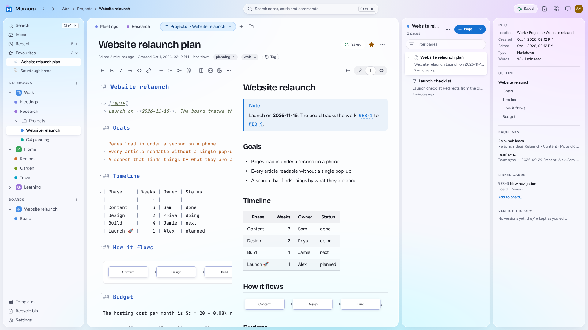
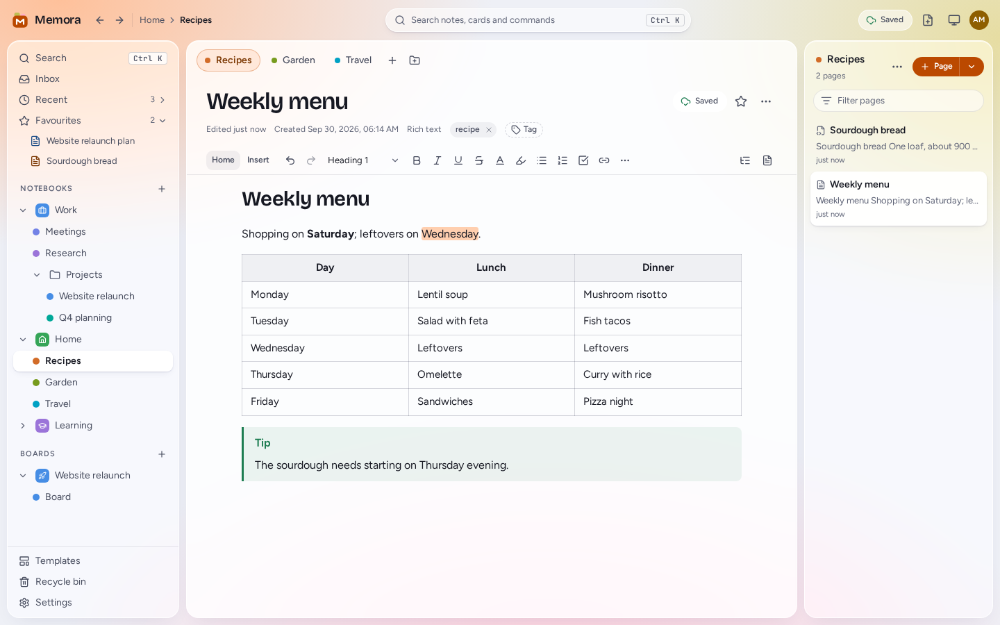
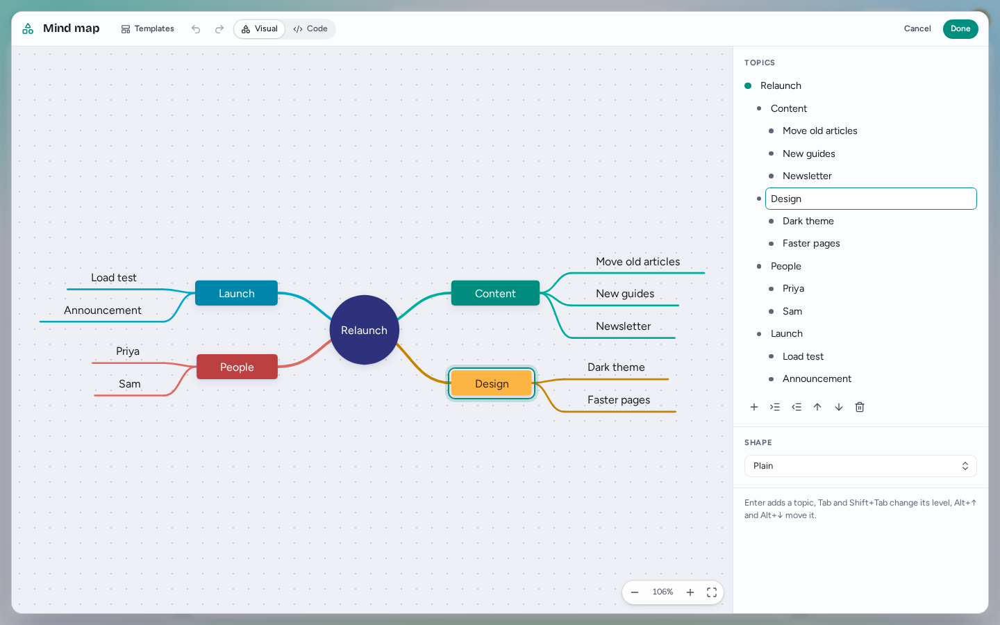
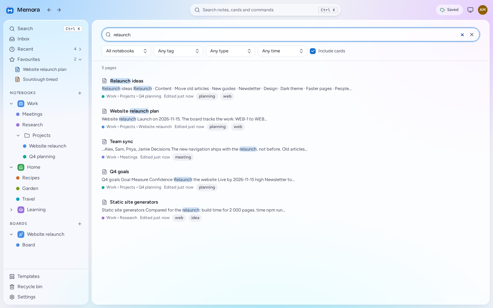
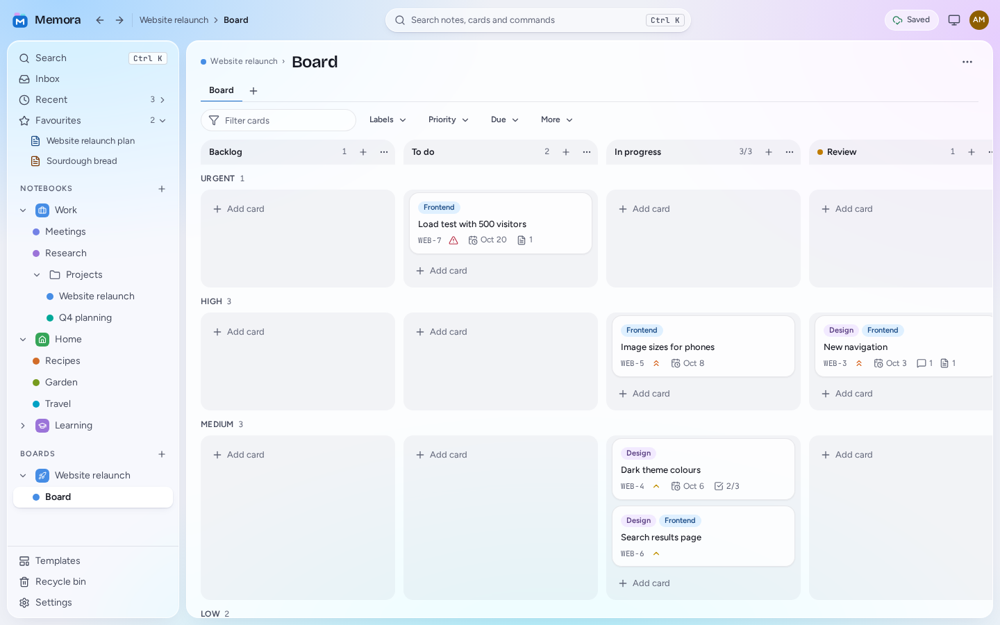
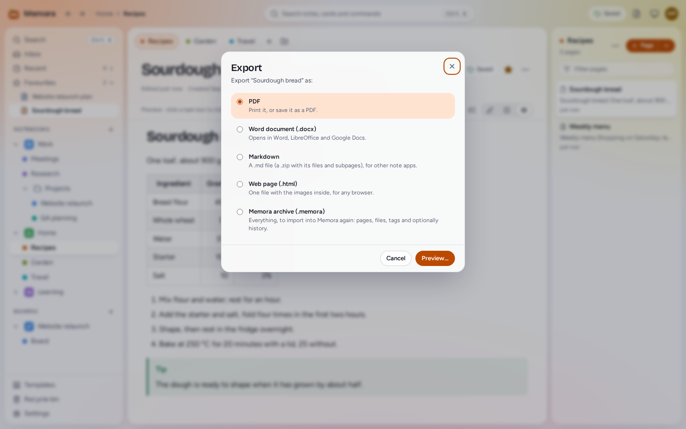

# Memora user guide

Memora keeps your notes the way a paper binder does: **notebooks** hold **sections**, and sections hold **pages**. You write each page in Markdown or as rich text, and the page saves itself as you type. It works offline, on every device, and next to Kanban boards for your projects.

This guide is for everyone who uses Memora, on a computer or through a server. Installing it is in [DESKTOP.md](DESKTOP.md) for the app on your computer, which has a few differences listed [there](DESKTOP.md#using-it), and in [SETUP.md](SETUP.md) for Memora Server.

- [Getting around](#getting-around)
- [Writing](#writing)
- [Links, tags and templates](#links-tags-and-templates)
- [Saving and syncing](#saving-and-syncing)
- [Finding things](#finding-things)
- [History and the recycle bin](#history-and-the-recycle-bin)
- [Kanban boards](#kanban-boards)
- [Wide screens: panes and layouts](#wide-screens-panes-and-layouts)
- [Offline and the app](#offline-and-the-app)
- [Import and export](#import-and-export)
- [Your account](#your-account)
- [For administrators](#for-administrators)
- [Keyboard shortcuts](#keyboard-shortcuts)

## Getting around



- **Notebooks** are listed on the left, each with a colour and an icon. A new notebook comes with a first section, so there is always somewhere to write. Drag notebooks to reorder them. For rename, colour and delete, right-click a notebook (or long-press it), or use its **…** button, which appears when you point at it (always, on touch screens).
- **Sections** are the coloured tabs along the top. Drag a tab to reorder it, or onto another notebook to move it; double-click to rename. When the tabs don't fit, an overflow menu lists them all.
- **Section groups** gather sections under one tab, and nest up to four levels. The group's tab shows where you are ("Clients › Acme") and opens a menu of its sections.
- **Pages** are listed beside the page, with the start of their text and when they changed. A page can have subpages, three levels deep.
  - Drag pages to reorder them, or onto a section tab to move them there.
  - `Alt+Shift+→` makes a page a subpage of the one above it; `Alt+Shift+←` moves it out again.
  - `Shift`-click or `Ctrl/Cmd`-click selects several pages, to move, copy or delete them together.
  - The page list's **⋯** menu moves the list to the other side of the screen.
- **The Inbox** is a section of your own for things to sort out later. **Quick note** (`Ctrl/Cmd+Alt+N`, or the pen button on phones) starts a new page there from anywhere.
- **Right-click** (or long-press) anything for its menu. Notebooks, section groups and sections also have a **…** button for it. Every menu item has a keyboard shortcut too, and `?` lists them all.

Memora remembers where you were: the last section, the last page in each section, and what was expanded. It opens there again, on any of your devices.

On a **phone**, each level has a screen of its own: notebooks, then sections, then pages, then the page. The back button goes up a level, and the pen button starts a quick note.

## Writing

Each page is **Markdown** or **rich text**. New pages are Markdown unless you choose otherwise in **Settings → Editing**. A page's menu (**⋯** in its header) converts it to the other kind.

### Markdown pages

The source is on the left, the finished page on the right, and the two scroll together. The switch in the page header shows the **source** alone, the **preview** alone, or both side by side; each page remembers its view. Narrow windows and phones switch between the two.

- **Tables line up by themselves.** `Tab` and `Shift+Tab` move between cells, adding a row at the end, and `Enter` goes to the next row. The columns are padded as you type, emoji and Chinese, Japanese and Korean characters included. `Ctrl/Cmd+Shift+F` formats the table under the cursor. Right-click a table for rows, columns, alignment and sorting, or **Edit as a grid…** to edit it like a spreadsheet.
- **Formatting:** the toolbar, or `Ctrl/Cmd+B` and `I`, `Ctrl/Cmd+1`…`6` for headings, `Ctrl/Cmd+Shift+7`, `8` and `9` for numbered, bullet and task lists, and `Ctrl/Cmd+K` for a link.
  - Typing `*`, `_`, `~` or a backtick over selected text wraps it.
  - Pasting a web address over selected text makes it a link.
  - Lists continue when you press `Enter`, and end on an empty item.
- **`/`** inserts a table, code, a diagram, a note box, an image, today's date or a template.
- **What the preview shows:**
  - GitHub-flavoured Markdown, with task lists you can tick in the preview and footnotes;
  - alerts (`> [!NOTE]`, `[!TIP]`, `[!WARNING]`…);
  - maths between `$…$` and `$$…$$`;
  - [diagrams](#diagrams) in ` ```mermaid ` blocks;
  - highlighted code, with a copy button.
- **Find and replace** (`Ctrl/Cmd+F`) works with regular expressions too.
- **Settings → Editing:** line numbers, wrapping, visible spaces, spelling, tab size, the longest line, and small pictures under image lines.
- The page's details panel (on narrower screens, a button in the page header) shows the headings to jump to, and the word count and reading time.

### Rich text pages



Rich text pages work like a page of a notebook, with a word processor's tools. The toolbar has **Home**, **Insert** and **Table** tabs. When the window is too narrow for one row, the toolbar takes two; on phones, **More** has everything.

- **The text starts at the top left**, under the title, and fills the pane. Drag its right edge to make it narrower: each page keeps its own width. Double-click the edge, or choose **Fit the text to the pane** in the page's **⋯** menu, to fill the pane again.
- `Enter` in the title goes on to the text. Clicking beside or below the text puts the cursor on the nearest line.
- Headings, bold, italic, underline, strikethrough, superscript and subscript; text colours and highlights; fonts, sizes, alignment and line spacing. `Ctrl+Space` clears the formatting of the selected text.
- **To-dos:** `Ctrl/Cmd+1` makes a line a to-do, and ticks it when it already is one. `Ctrl/Cmd+Enter` ticks or unticks it. Done items are struck through.
- **`Tab` and `Shift+Tab` indent:** a list item moves a level, and other text moves in or out a step. In a table they go to the next or previous cell. `Esc`, then `Tab`, leaves the page.
- Lists, quotes, note boxes, dividers, code blocks and maths.
- Tables with a header row, merged cells, cell colours and resizable columns: right-click a cell for the table menu.
- Selecting text shows a small formatting menu; `/` inserts blocks; the handle beside a block drags it elsewhere.
- **Pasting from Word, Google Docs and web pages** keeps the formatting, cleaned up: lists stay lists, and stray fonts and colours go.
- **Settings → Editing → Rich text pages:**
  - **Spacing:** **Compact** (the default) keeps lines and paragraphs close together, as in a notebook; **Comfortable** gives them more room.
  - **Font** and **Font size** for text without its own. The toolbar's font list has common fonts. In the desktop app and in Chrome or Edge, **This computer's fonts…** lists the fonts installed on your computer; a page set in one of them shows a similar font on computers that don't have it.
  - **Show pages as** lays the page out as an A4 or Letter sheet, to see what a Word or PDF export will look like.

Converting a rich page to Markdown first lists what Markdown can't keep (colours, font sizes, indents, merged cells). The page as it was is always kept in its history.

### Images and files

- **Paste a screenshot**, drop an image, or use **Insert → Image…**: it is stored with the page.
- **Images pasted from a web page** are downloaded by the Memora server, so your page never depends on that website. If that fails, Memora tells you and keeps the image's web address.
- In rich pages, drag an image's corner to resize it; its menu sets the alignment, a caption and a description for screen readers. Click an image to see it full size.
- **Other files** (a PDF, a spreadsheet) become a file block to download. The largest file is set by your administrator: 25 MB unless they changed it.
- **Settings → Editing → Images** can shrink large photos as you paste them (off unless you turn it on). Screenshots stay sharp.

### Diagrams



Flowcharts, mind maps, sequence diagrams, timelines, Gantt charts and pie charts, drawn in Memora's colours and edited by pointing and typing. Underneath, a diagram is [Mermaid](https://mermaid.js.org) code, so it travels with the page: Markdown exports, GitHub and other Mermaid tools draw it too.

- **A new diagram:** type `/diagram` in any page, or use **Insert → Diagram** (rich pages) or the toolbar's **More → Diagram…** (Markdown pages). Pick a template from the gallery, or start blank.
- **The editor** shows the drawing, with a panel beside it (below it on a phone) that lists everything in the diagram. **Done** (`Ctrl/Cmd+Enter`) puts the diagram in the page; **Cancel** or `Esc` leaves the page as it was. `Ctrl/Cmd+Z` undoes, also what was typed in the panel or the code, and brings back what was selected. **Templates** starts again from another one.
- **Words are edited where they are**, in every kind of diagram: double-click a box, topic, participant, message, note, block, period, task or slice (or its value) on the drawing, or select it and press `F2`, or simply start typing. `Enter` keeps the words, `Shift+Enter` breaks a line where the label can have several, `Tab` keeps them and goes on (to a connected box, a topic under it, the reply to a message), and `Esc` leaves them as they were. The same words can be edited in the panel; a click on the drawing selects the panel's row, and a row being edited marks its item on the drawing.
- **Keys**, after MindManager's where they fit (`?` in the editor shows them all):

  | Keys                        | Does                                                                         |
  | --------------------------- | ---------------------------------------------------------------------------- |
  | `Enter` / `Shift+Enter`     | Add the next item after the selected one / before it                         |
  | `Tab` or `Insert`           | Add an item under it: a connected box, a topic under it, the reply, an event |
  | `Ctrl/Cmd+Shift+Enter`      | Add a box before it, a topic above it; put a step in a loop                  |
  | `Alt+Enter`                 | Sequence diagrams: add a note                                                |
  | Arrow keys, `Home`, `End`   | Select the item that way, the first, the last                                |
  | `Ctrl/Cmd+Backspace`        | Select the topic or block it is in                                           |
  | `Alt+↑` / `↓`               | Move the item (a step moves into and out of blocks, a task across sections)  |
  | `Alt+Shift+←` / `→`         | A topic a level out or in; a step out of or into a block                     |
  | `Alt+←` / `→`               | Move a participant                                                           |
  | `Delete`                    | Delete the selection (a block or group: its contents stay)                   |
  | `Ctrl/Cmd+Shift+Delete`     | Delete keeping the flow (boxes), what is under it (topics); a whole block    |
  | `Ctrl/Cmd+D`, `C`, `X`, `V` | Duplicate, copy, cut, paste                                                  |
  | `Ctrl/Cmd+A`, `K`, `G`      | Flowcharts: select every box, connect the selected ones, group them          |
  | `Ctrl/Cmd+1…9`, `Alt+0…8`   | Shape; colour (`Alt+0`: none)                                                |
  | `Ctrl/Cmd++`, `−`, `0`      | Zoom in, out, to fit                                                         |

  In the panel, `Enter` in a row adds the next one, `Alt+↑`/`↓` move it, and `↑`/`↓` go to the field above or below.

  - **Flowcharts:** the **+** beside a selected box adds a connected one; the smaller one adds one beside it. Drag a box onto another to connect them, onto a group to put it in, or onto empty space to take it out of its group. `Shift`-click, or `Shift` and a drag over empty space, selects several boxes. The panel sets shapes and colours (with their keys in the tooltips), an arrow's label, line and ends, and groups.
  - **Mind maps:** the outline in the panel is the same map: `Enter` adds a topic, `Insert` one under it, `Tab` and `Shift+Tab` change its level, and `Backspace` in an empty topic removes it (what was under it stays). Memora lays the map out around its centre, branches either side, each in its own colour.
  - **Sequence diagrams:** the participants, then the steps in order: messages, notes, and blocks such as loops and alternatives. New steps go after the selected one, or inside the selected block. Each message has a menu for its arrow (and starting or ending an activation); drag a step by its grip, or press `Alt+↑`/`↓`, to move it, into and out of blocks.
  - **Timelines, Gantt charts and pie charts** are lists: periods and their events; tasks with their progress (done, active), whether they are critical or a milestone, and when they start and end (a date, a length, or another task); slices and their values. Sections can be moved, and removed with or without what they hold.

- **In rich pages** a diagram is selected like an image. Its toolbar opens the editor (or press `Enter`), sets the size (Natural size, Small, Medium, Large, or **Fit**, which fills the text's width; or drag the corner) and alignment, adds a caption and copies the diagram as a picture.
- **In Markdown pages** diagrams are drawn in the source too, in place of their code, also in list items, quotes and callouts. Point at one for **Edit diagram** and **Show code**; moving the cursor into it with the arrow keys shows its code. The preview has an **Edit** button, and the editor a **Code** tab. **Settings → Editing → Draw diagrams in the source** turns drawing in the source off. ` ```mermaid ` may be written in any case.
- **Converting a page** between rich text and Markdown keeps its diagrams, as often as you like. A diagram in a rich table's cell moves to just below the table in Markdown (the convert dialog says so).
- **Mermaid the editor doesn't know**, a type it can't edit or features beyond it, is still drawn. Such a diagram opens as code; what the visual editor doesn't know is kept as you wrote it.
- **Exports** draw diagrams too: as pictures in Word documents, and as sharp drawings in PDF and HTML.

## Links, tags and templates

- **Links between pages:** type `[[` and start typing a page's name. Links keep working when the page is renamed or moved. A link to a page that no longer exists is marked, and hovering a link shows the start of the page.
- **Backlinks:** the page's details panel lists the pages that link to it.
- **Card keys** such as `WEB-42` link to that Kanban card by themselves.
- **Tags:** add them in the page header. Search's start screen lists every tag with its number of pages, where you can rename, recolour or delete it.
- **Favourites:** the star in the page header. Favourites and recent pages are at the top of the navigation.
- **Templates:** start a page from one with **▾** beside **+ Page**, **From a template** in an empty section, or **New page from a template…** in a section's right-click menu. **Default template…**, in the same menus, makes every new page in a section start from one. `/template` inserts a template into a page. Memora has five built in; **Save as template…** in a page's **⋯** menu adds your own. `{{title}}`, `{{date}}` and `{{time}}` are filled in.

## Saving and syncing

You never need to save. What you type is kept on the device at once, and sent to the server within a few seconds. `Ctrl/Cmd+S` sends it right away.

- The indicator in the page header says where things stand. **Saved** appears only once the server has the change.
- Your other devices and tabs show the change within moments. The page header says when a page is also open elsewhere ("Also open on: Firefox on Windows").
- If a Markdown page changed on two devices at once, Memora merges the two by itself when the changes don't overlap.
- When they do overlap, the page shows a conflict with **Keep mine**, **Keep theirs** and **Compare**. Compare shows the two side by side and lets you choose, change by change. Nothing is lost: both versions stay in the page's history.

**Memora for your computer** can keep several computers in sync too, through a folder in your cloud storage (Google Drive, kDrive, Nextcloud): see [Sync your computers](DESKTOP.md#sync-your-computers).

## Finding things



- **Search** (`Ctrl/Cmd+Shift+F`, the search field, or the Search tab on phones) looks through titles, text and tags as you type. Titles count most.
  - `"exact phrase"` finds the words together.
  - `-word` leaves out pages with that word.
  - `tag:work` and `in:"Section name"` narrow it down, as do the filters beside the results (notebook, section, tag, kind of page, when it changed). **Include cards** searches Kanban cards too.
  - Without a connection, search looks through the titles on the device.
- **The command palette** (`Ctrl/Cmd+K`) opens any page by name, recent ones first, and runs any command: type what you want to do. In a Markdown page, where `Ctrl/Cmd+K` makes a link, use `Ctrl/Cmd+P`.
- **Back and forward** (`Alt+←` and `Alt+→`) go through the pages you opened. Every page has its own address, so **Copy link** in a page's menu gives a link that opens it.

## History and the recycle bin

- **History** (a page's menu, or its details panel) lists the versions of the page by day, with why and on which device each was kept.
  - Memora keeps a version every ten minutes or so while you write, and when you close a page you changed.
  - **Save version…** keeps one by hand, with a name if you like.
  - Open a version to read it, see what changed since the one before, or compare it with the page now.
  - **Restore** puts it back (the page as it was is kept first, so a restore can be undone), or **Restore as copy** makes a new page of it.
  - Old versions are thinned out: all of them for two days, then one an hour for two weeks, one a day for three months, then one a week. Named versions are always kept.
- **The recycle bin** (in the navigation, or the palette) has everything you deleted, for 30 days. **Restore** puts an item back where it was, or somewhere you choose. **Delete for good** and **Empty the recycle bin** can't be undone.

## Kanban boards



- A **project** holds boards and gives its cards a key, such as `WEB` for `WEB-1`, `WEB-2`… Boards start from a template (basic, extended or empty) and show as tabs above the board.
- **Columns** can be renamed, reordered, coloured and collapsed, and can have a **WIP limit**: it warns when there are too many cards, or stops more coming in. A column marked **Done** is where finished cards go.
- **Swimlanes** divide the board across, by lanes of your own or automatically by priority or label.
- **Cards:** **Add card** at the bottom of a column (or `N` on the board) adds one. Drag cards with the mouse or a finger (a long press on phones; `Esc` cancels a drag). With the keyboard, the arrow keys go from card to card, `Ctrl/Cmd+Shift` with an arrow moves the card, and `Enter` opens it. `Ctrl/Cmd+Z` undoes a move.
- **The card panel** (click a card) has a description, labels, a priority, dates, checklists, comments, attachments (paste them in) and the card's history.
- **Linked notes:** **Link notes** on a card picks pages (recent ones first, or search), or makes a new one. A page's details panel shows its **Linked cards**, and its menu has **Add to board…**.
- Each board has **filters** and a search box, and keeps its **archived cards** apart. **Move to…** and **Duplicate** move or copy cards to other boards and projects.
- On phones, swipe between columns; **Move to…** moves a card without dragging.

## Wide screens: panes and layouts

On a wide screen, **panes** open beside the main page: one on a wide screen, up to three on an ultra-wide one. Each pane holds tabs of pages, boards, search, backlinks or history.

- `Ctrl/Cmd+\` (or **Open the page in a new pane** in the command palette) opens the page beside the one you're reading. In the page list, a page's right-click menu has **Open in a pane**.
- Drag the edge between panes to resize them.
- **Save this layout…** in the layout menu keeps the panes and their tabs under a name, to come back to.
- Each kind of screen (wide, ultra-wide) remembers its own panes.
- **Settings → Editing → Line length** sets how wide Markdown text runs (70 to 100 characters). A Markdown page's **Full width** option uses the whole pane. Rich text fills the pane; drag its right edge to make it narrower.

## Offline and the app

Memora works without a connection. The pages you opened lately are kept on each device, and you can write, create pages and move around. Changes wait on the device, and are sent when the connection is back.

- The status in the top bar shows when you're offline, or when only some of your changes are sent.
- **Settings → This device → Keep every page on this device** makes every page open offline, at the cost of some space.
- Notebooks and sections need a connection to create or change.
- Offline mode needs **HTTPS** (or `localhost`): browsers allow it only there.

**Installing the app.** Memora installs like an app, with its own window and icon:

- **Chrome and Edge** (Windows, Linux, macOS, Android): the install icon at the end of the address bar, or the browser menu's install item (on Android: **Add to Home screen → Install**).
- **Safari on iPhone and iPad:** **Share → Add to Home Screen**.
- **Safari on a Mac:** **File → Add to Dock**.
- **Firefox** installs no apps; on Android it adds a shortcut to the home screen.

When a new version of Memora is ready, the app offers to update. Nothing changes under your feet while you write.

## Import and export



**Export** is in the menu of every page, section and notebook. **Settings → Import & export** exports everything.

| Format         | What for                                                                                                                     |
| -------------- | ---------------------------------------------------------------------------------------------------------------------------- |
| Memora archive | Everything, to keep or to move to another Memora: pages, files, tags, templates, history and boards. It can have a password. |
| Markdown       | For other apps: `.md` files in folders, with the images beside them                                                          |
| Word (`.docx`) | A page or a section as a document                                                                                            |
| HTML           | A page as a web page                                                                                                         |
| PDF            | A page laid out in pages, printed or saved from the preview (or downloaded directly, if your administrator set that up)      |

**Import** in **Settings → Import & export**:

- Memora archives, and zips of Markdown files, become notebooks, or are merged into one you choose.
- Markdown, text, Word and web pages become pages in your Inbox.
- Dropping files onto a page list or a section tab imports them there.

Big imports and exports run in the background, and a download stays ready for a day.

## Your account

**Settings → Account**:

- **Profile:** your name as others see it.
- **Password:** at least 12 characters. A few unrelated words make a strong one, and the meter shows how strong a new one looks. Changing it signs you out on your other devices.
- **Devices:** where you're signed in, and when each was last used. Sign out any you don't recognise.
- **Remember this device** (when you log in) keeps you signed in for 30 days of not using Memora. Without it, 12 hours.

### Two-step verification

With two-step verification, logging in also asks for a six-digit code from an app on your phone, so someone who learns your password still can't get in.

1. Install an authenticator app, such as 2FAS, Aegis, Google Authenticator or Microsoft Authenticator. The one in your password manager (Bitwarden, 1Password) works too.
2. **Settings → Account → Two-step verification → Set up**, and enter your password.
3. Scan the QR code with the app, or type the key under it.
4. Enter the code the app shows, then **Turn on**.
5. **Save the ten recovery codes** (Copy or Download), for example in your password manager. Each lets you log in once without your phone. They are shown only this once.

From then on, logging in asks for the code after your password. **Lost your phone? Use a recovery code** takes one of those codes instead. Afterwards, set up the app again (turn two-step verification off, then on) and make new recovery codes.

- **New recovery codes** replaces the old ones; do it when few are left.
- **Turn off** asks for your password.
- If your administrator requires two-step verification, Memora asks you to set it up before anything else.
- Lost both the phone and the codes? Your administrator can turn it off for you.

## For administrators

The first account is the administrator. Administrators manage accounts and the server; they can't read other people's notes.

- **Settings → Users:**
  - **Add user** gives the person a one-time password to log in with. They choose their own at the first login.
  - Each person's **⋯** menu edits them, resets their password, turns off their two-step verification, disables the account or deletes it.
  - **Require two-step verification** asks everyone to set it up, once you use it yourself.
- **Settings → Audit log** lists logins, failed logins and changes to accounts, security, backups, imports and exports for the last year.
- **Settings → Backups** lists the backups, makes one now, downloads one, or restores one (Memora restarts to put it in place). [BACKUP_RESTORE.md](BACKUP_RESTORE.md) has the details.
- Locked out? `memora-admin` inside the container resets passwords and two-step verification: see [SETUP.md](SETUP.md#locked-out-memora-admin).

## Keyboard shortcuts

`?` shows every shortcut. `Ctrl` on Windows and Linux is `Cmd` on a Mac.

| Keys                    | Does                                                                            |
| ----------------------- | ------------------------------------------------------------------------------- |
| `Ctrl/Cmd+K`            | Command palette: open a page or run a command (`Ctrl/Cmd+P` in a Markdown page) |
| `Ctrl/Cmd+Shift+F`      | Search all pages (in a Markdown table: format the table)                        |
| `Ctrl/Cmd+Alt+N`        | Quick note to the Inbox                                                         |
| `Alt+N` / `Alt+Shift+N` | New page / new subpage                                                          |
| `F2`                    | Rename                                                                          |
| `Ctrl/Cmd+Alt+M`        | Move or copy                                                                    |
| `Delete`                | Delete the selected pages                                                       |
| `Alt+Shift+→` / `←`     | Make a subpage / move out a level                                               |
| `Alt+Shift+↑` / `↓`     | Move the page up / down                                                         |
| `Alt+↑` / `↓`           | Previous / next page                                                            |
| `Alt+PgUp` / `PgDn`     | Previous / next section                                                         |
| `Alt+←` / `→`           | Back / forward                                                                  |
| `Ctrl/Cmd+\`            | Open the page in a new pane (wide screens)                                      |
| `Ctrl/Cmd+S`            | Send changes to the server now                                                  |
| `Ctrl/Cmd+F`            | Find (and replace) in the page                                                  |
| `Esc`, then `Tab`       | Leave the editor, to move on with the keyboard                                  |

In rich text pages, `Ctrl/Cmd+1` and `Ctrl/Cmd+Enter` handle to-dos, `Tab` and `Shift+Tab` indent, and `Ctrl+Space` clears formatting. The diagram editor's keys are in [Diagrams](#diagrams). `?` lists each editor's keys.

In lists and trees, the arrow keys move and expand, `Enter` opens, and `Shift`-click or `Ctrl/Cmd`-click selects several.
